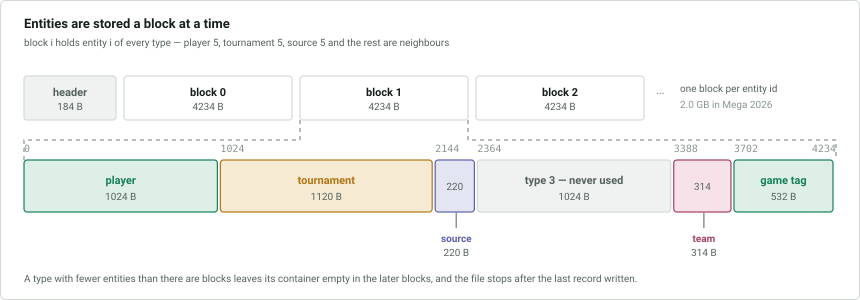

# `.2lid` — entities

Holds everything a game header refers to by id: players, tournaments, sources,
teams and game tags. **The header of this file is big-endian**; the entity
records are little-endian like the rest of the format.

## Entity types

There are six types, always in this order. The index is the type's position in
the file header, and each type has a fixed container size in bytes.

| Index | Type | Container |
|---|---|---|
| 0 | player | 1024 |
| 1 | tournament | 1120 |
| 2 | source | 220 |
| 3 | **unknown** | 1024 |
| 4 | team | 314 |
| 5 | game tag / text title | 532 |

Container sizes come from the header, not from this table.

Type 3 never holds an entity, and its purpose is **unknown**.

Annotators are not a separate type: an annotator is a player, sharing the same
ids. Likewise the titles of guiding texts and of analyses are entities of type 5.

## File header

All integers **big-endian**. *T* is the number of entity types.

| Offset | Size | Type | Description |
|---|---|---|---|
| 0x00 | 4 | int | header size in bytes, 184 |
| 0x04 | 4 | int | number of entity types, 6 |
| 0x08 + 20·*i* | 4 | int | container size of type *i* |
| 0x0c + 20·*i* | 8 | long | number of entities of type *i* |
| 0x14 + 20·*i* | 8 | long | id of the first deleted entity of type *i*, −1 if none |
| 0x80 | 56 | | unknown |

The 56 bytes at the end are the `int` pairs (−1, 1), (0, 1), (1, 1), … (5, 1) —
a leading pair and then one per entity type. They do not vary, so they are not
counts; their meaning is **unknown**.

## Blocks

Entities are stored in blocks immediately after the header. The **block size** is
the sum of all container sizes.

- Block *i* starts at `header size + i · block size` and holds entity *i* of
  **every** type.
- Within a block the types appear in the order above, each occupying its
  container size. With the standard sizes, the containers start at 0, 1024,
  2144, 2364, 3388 and 3702.
- A type with fewer entities than there are blocks has unused containers in the
  later blocks.
- The file ends immediately after the last record written, so the final block is
  usually truncated.

A database with no entities is the header alone.

## Records

Every record, of every type, begins with its length:

| Offset | Size | Type | Description |
|---|---|---|---|
| 0x00 | 4 | int | number of bytes that follow |

A record is therefore `4 + length` bytes, and the remainder of its container is
zero. **A length of 0 marks an unused container**, that is, an entity id that
does not exist for that type.

The tables below list each type's fields in order, beginning with that length.

### Player

| Size | Type | Description |
|---|---|---|
| 4 | int | record length |
| 4 | int | length of last name |
| *n* | | last name |
| 4 | int | length of first name, 0 if none |
| *m* | | first name |
| 4 | int | unknown, always 0 |
| 4 | int | unknown, always 0 |
| 4 | int | id in ChessBase's player database: −1 not looked up, 0 no match |
| 4 | int | size of the field below; always 8 |
| 8 | long | FIDE id: −1 not looked up, 0 none |

The record ends after the FIDE id.

The two ids link a player to data ChessBase keeps outside the database — titles,
ratings, birth dates, photographs — and take these combinations:

| ChessBase id | FIDE id | Meaning |
|---|---|---|
| −1 | −1 | never looked up |
| 0 | 0 | looked up, no match |
| id | 0 | matched, no FIDE id |
| id | FIDE id | matched, with a FIDE id |

The two zero `int`s before the ChessBase id, and the 8 before the FIDE id, never
vary. The 8 is the size of the field it precedes and is likely its length, and the
two zeros are likely the lengths of strings that are always empty, but both are
**unknown**.

### Tournament

| Size | Type | Description |
|---|---|---|
| 4 | int | record length |
| 4 | int | length of place |
| *n* | | place |
| 4 | int | length of title |
| *m* | | title |
| 108 + 2*k* | | the tail below, *k* being the number of tiebreak rules |

**The place precedes the title.** The tail:

| Offset | Size | Type | Description |
|---|---|---|---|
| 0 | 4 | int | start date |
| 4 | 1 | byte | [type and time control](#tournament-type) |
| 5 | 1 | byte | bit 0 = team tournament |
| 6 | 1 | byte | nation at the time of the tournament |
| 7 | 1 | byte | unknown, always 0 |
| 8 | 1 | byte | category |
| 9 | 1 | byte | flags: bits 0 and 1 complete, bit 2 board points, bit 3 three points for a win |
| 10 | 1 | byte | number of rounds |
| 11 | 1 | byte | unknown, always 0 |
| 12 | 4 | float | latitude of the place, 0 if unknown |
| 16 | 4 | float | longitude |
| 20 | 1 | byte | nation the place lies in today, 0 if unknown |
| 21 | 37 | | unknown, see below |
| 58 | 2 | short | *k*, the number of tiebreak rules |
| 60 | 2·*k* | short | the [tiebreak rules](#tiebreak-rules), in the order they apply |
| 60 + 2*k* | 4 | int | end date |
| 64 + 2*k* | 44 | | unknown, always 0 |

The **two nations differ in meaning**. The byte at 6 is the nation at the time
the tournament was played and uses historical states where appropriate. The byte
at 20 accompanies the coordinates and is the nation the place lies in today; it
is never set unless the coordinates are, and is the same for every tournament
held in a given place. A tournament played in Breslau is therefore German at 6
and Polish at 20.

Bytes 21-57 are zero except for the value 7 at 34, 45 and 56 — three of something
11 bytes apart, **unknown** — and a flag at 57. Most tournaments have the three
7s and 0 at 57; a few have no 7s and 1 at 57 instead, for reasons **unknown**.

#### Tournament type

The low 5 bits of the byte at tail+4:

| Value | Type | Value | Type |
|---|---|---|---|
| 1 | single game | 5 | team tournament |
| 2 | match | 6 | knockout |
| 3 | round robin | 7 | simultaneous |
| 4 | swiss (open) | 8 | scheveningen |

Bit 5 means blitz, bit 6 rapid and bit 7 correspondence; none set means a normal
time control.

#### Tiebreak rules

Stored as a count and that many `short`s, in the order they are applied. Choosing
"not set" stores rule 0 and counts as a rule; leaving a slot undefined stores
nothing.

| Id | Rule | Id | Rule |
|---|---|---|---|
| 0 | not set | 13 | number of black games |
| 1 | rating of Buchholz | 14 | point group |
| 2 | feine Buchholz | 16 | median2 Buchholz |
| 3 | median Buchholz | 17 | Buchholz cut 1 |
| 4 | Fortschritt | 18 | Buchholz cut 2 |
| 5 | Sonneborn-Berger (swiss) | 19 | Sonneborn-Berger (round robin) |
| 11 | number of wins | 21 | Koya |
| 12 | number of black wins | | |

Swiss and round robin have separate Sonneborn-Berger rules. Ids 6-10, 15 and 20
have not been seen.

### Source

| Size | Type | Description |
|---|---|---|
| 4 | int | record length |
| 4 | int | length of title |
| *n* | | title |
| 4 | int | length of publisher |
| *m* | | publisher |
| 4 | int | publication date |
| 4 | int | date |
| 2 | short | version |
| 2 | short | quality: 0 unset, 1 high, 2 medium, 3 low |

The tail after the two strings is always 12 bytes.

### Team

| Size | Type | Description |
|---|---|---|
| 4 | int | record length |
| 4 | int | length of title |
| *n* | | title |
| 1 | byte | team number, 0 if not set |
| 1 | byte | bit 0 = the year denotes a season spanning two years |
| 2 | short | year, 0 if not set |
| 1 | byte | nation |

### Game tags and text titles

One entity type serves two purposes that ChessBase presents separately. **Which
one an entity is depends solely on what refers to it**: a game points at its game
tag from 0x50 of its record, a guiding text at its title from 0x28, and an
analysis at its title from 0x18. Nothing in the entity distinguishes them, and
all three share one id space.

| Size | Type | Description |
|---|---|---|
| 4 | int | record length |
| 4 | int | number of titles |
| … | | that many titles, below |

Each title:

| Size | Type | Description |
|---|---|---|
| 4 | int | language, as a nation code |
| 4 | int | length of the title |
| *n* | | the title |

Titles are stored in ascending order of language code. ChessBase writes an entry
for each of the seven languages it offers even when only one is filled in, the
others having length 0. An entity with no titles at all — a record length of 4
and a count of 0 — is the placeholder a game refers to when it has no game tag.

## Deleted entities

A deleted entity keeps its container and its id, and remains in the entity count
in the file header. Deleted entities of a type form a **singly linked list**: the
header holds the id of the first, and each deleted record holds the id of the
next, with −1 ending the list.

Nothing in a record marks it as deleted, so **the list must be followed** to know
whether a given entity is deleted.

| Size | Type | Description |
|---|---|---|
| 4 | int | record length, always 16 |
| 8 | | `22 33 44 55 66 77 88 99`, identical in every deleted record; meaning **unknown** |
| 8 | long | id of the next deleted entity of the same type, −1 at the end |

Newly deleted entities are inserted at the head, so the list runs from the most
recently deleted to the oldest.
