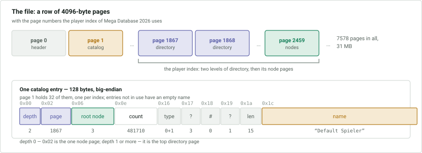
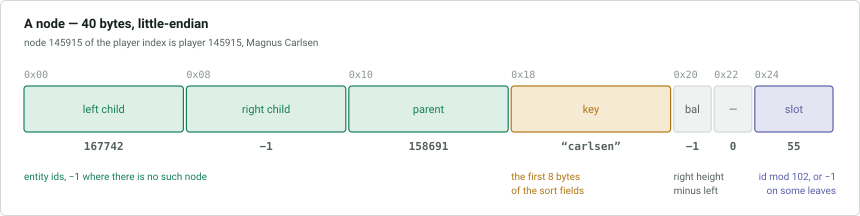
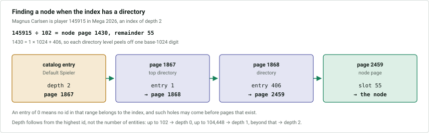
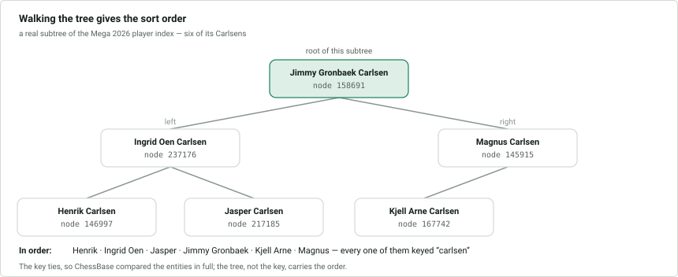
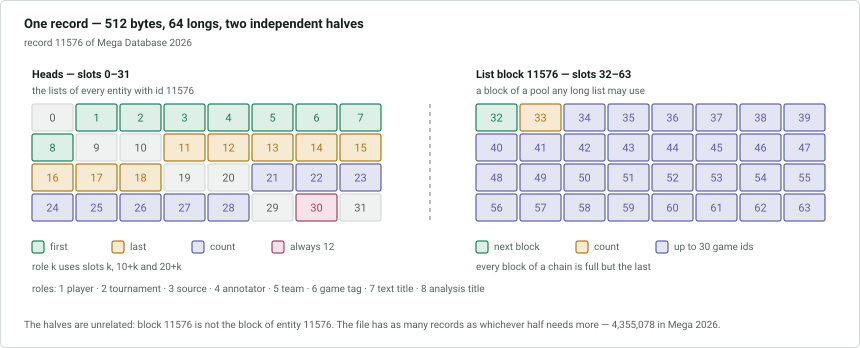
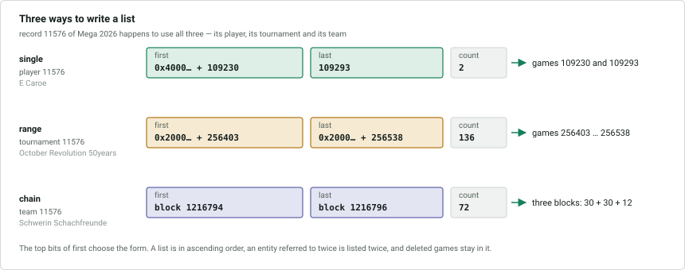

# `.2lcd` and `.2lgd` — the entity indexes

Two files index the entities of the [`.2lid`](4-entities.md) file. Both are
derived data: they can be rebuilt from the game headers and the entities, but
ChessBase relies on them and a writer must keep them correct.

- **`.2lcd`** holds a sort order for each kind of entity, as a balanced binary
  tree.
- **`.2lgd`** holds, for each entity and each role it can play, the list of
  records that refer to it.

# `.2lcd` — sort orders

A sequence of 4096-byte pages.

| Page | Contents |
|---|---|
| 0 | file header |
| 1 | catalog of indexes |
| 2 and up | node pages and directory pages |

**The file header and the catalog are big-endian**; node pages and directory
pages are little-endian.

## File header

| Offset | Size | Type | Description |
|---|---|---|---|
| 0x00 | 4 | int | unknown, 1 |
| 0x04 | 4 | int | number of pages in the file |
| 0x08 | 4 | int | page size, 4096 |

The page count times the page size is the size of the file. The rest of page 0 is
zero.

## Catalog

Page 1 holds 32 entries of 128 bytes. Entries beyond those in use have an empty
name.

| Offset | Size | Type | Description |
|---|---|---|---|
| 0x00 | 2 | short | depth: the number of levels of directory pages above the node pages |
| 0x02 | 4 | int | the node page when the depth is 0, otherwise the top directory page |
| 0x06 | 8 | long | root node, −1 if the index is empty |
| 0x0e | 8 | long | number of nodes |
| 0x16 | 1 | byte | entity type + 1 |
| 0x17 | 1 | byte | unknown, always 3 |
| 0x18 | 1 | byte | unknown; the index's number within its entity type |
| 0x19 | 1 | byte | unknown, always 1 |
| 0x1a | 2 | short | length of the name |
| 0x1c | *n* | | the name, in Latin-1 |

Eight indexes exist. The names are German by default but are not fixed strings
and should not be relied on.

| Index | Entities | Sort fields |
|---|---|---|
| Default Spieler | players with at least one game | last name, first name |
| Default Turnier | tournaments | year (oldest first), title, place, month, day |
| Default Quelle | sources | title |
| Default Kommentator | players who annotated a game, text or analysis | last name, first name |
| Default Mannschaften | teams | title, team number, nation, year, season |
| Default Partietitle | game tags used by games | language, title |
| Texttitel | game tags used as the title of a guiding text | language, title |
| Analysen | game tags used as the title of an analysis | language, title |

Players and annotators are the same entity type but are indexed separately, each
index holding only the entities used in that role; the game tag type likewise has
three indexes.

## Nodes

**A node's number is the id of its entity**, so node 5 of the player index
describes player 5.

A node page holds 102 nodes of 40 bytes, node *n* at offset `40 · (n mod 102)`.
The last 16 bytes of a page are unused. Containers for entities not in the index
hold zero or stale data and must be ignored.

| Offset | Size | Type | Description |
|---|---|---|---|
| 0x00 | 8 | long | left child, −1 if none |
| 0x08 | 8 | long | right child, −1 if none |
| 0x10 | 8 | long | parent, −1 for the root |
| 0x18 | 8 | long | [key](#keys) |
| 0x20 | 2 | short | balance: height of the right subtree minus that of the left, −1 to 1 |
| 0x22 | 2 | short | unknown, always 0 |
| 0x24 | 4 | int | the node's slot in its page (`id mod 102`), or −1 |

The tree is an AVL tree. An in-order walk from the root named in the catalog
yields the entities in sort order.

The value at 0x24 is −1 in some leaves and the slot number otherwise. Which
leaves is **unknown**; it may mark a node that has never had a child.

### Page lookup

With a depth of 0 the catalog points directly at the single node page. Otherwise
it points at a **directory page**: 1024 `int`s, entry *k* giving the page number
that holds node page *k*. **An entry of 0 means no such page exists**, because no
id in that range belongs to the index; such holes may precede non-zero entries.

With more than 1024 node pages the directory pages get a directory of their own,
and so on. The depth in the catalog counts these levels, and follows from the
highest entity id in the index rather than the number of entities:

| Highest id | Depth |
|---|---|
| up to 102 | 0 |
| up to 104,448 (102 · 1024) | 1 |
| up to 106,954,752 | 2 |

## Keys

The key is the first 8 bytes of the entity's sort fields, compared as an unsigned
big-endian integer, but stored in the node as a little-endian `long` — so its
bytes appear in the file in reverse. It exists to make the common comparison a
single integer compare; nodes with equal keys, and nodes without one, are ordered
by comparing the entities in full.

| Entities | Key | Characters permitted |
|---|---|---|
| players, annotators | first 8 characters of the last name | `a-z`, digits, space, `-` |
| tournaments | the year as 2 bytes, then the first 6 characters of the title | `a-z` and digits |
| sources, teams | first 8 characters of the title | any ASCII |
| game tags | language (1 byte, a nation code), then the first 7 characters of the first title | any ASCII, checked over 8 characters |

The text is lowercased and padded with zero bytes. **The key is 0 when any of the
characters it would be built from is not permitted** — the node still occupies
its correct place in the tree, so a key of 0 simply means the entity must be
compared in full. The permitted sets differ per entity because they are exactly
the characters whose ASCII order agrees with the full comparison below.

An entity whose sort fields are all empty takes the key 1, placing it first. A
tournament with only a year takes the year followed by six zero bytes.

*Every node in it carries the same key, so the order came from comparing the
entities in full.*

## How text is compared

The full comparison resembles the Windows `CompareString` collation rather than a
byte comparison:

- Case is ignored, and accents are ignored at the first pass: `Cífer` compares as
  `cifer`. When two texts are otherwise equal, the unaccented one comes first.
- Symbols sort before digits, and digits before letters. Symbols follow the
  Windows order, which is ASCII's except that `+ < = >` come after all other
  punctuation. Figurine characters (U+E024-U+E029) sort after the letters.
- Apostrophes are ignored for players and annotators; apostrophes and hyphens are
  ignored for tournaments. For other entity types they are ordinary symbols.
  Spaces always count.
- Sort fields are compared in the order listed in the catalog. Entities equal in
  every field are ordered by id.

The exact treatment of apostrophes and hyphens is **not fully determined**; a
small number of neighbouring pairs in large databases do not fit these rules.

# `.2lgd` — the games of each entity

Lists, for every entity, the records that refer to it. All little-endian.

| Offset | Size | Type | Description |
|---|---|---|---|
| 0x00 | 4 | int | unknown, always 256, which is the size of each half of a record |
| 0x04 | 4 | int | number of list blocks in use |
| 0x08 | 4 | int | unknown, always 0 |

A 12-byte header is followed by 512-byte records. Nothing gives the number of
records; it follows from the file size. A database with no entities is the header
alone.

## Records

Record *i* has two independent halves:

- **the heads**, at 0x000-0x0ff: the game lists of every entity whose id is *i*,
  of whatever type, exactly as the blocks of the `.2lid` file work;
- **list block** *i*, at 0x100-0x1ff: one block of a shared pool used by the
  longer lists, unrelated to the entity *i*.

The file therefore has as many records as whichever of the two needs more.

The heads are 32 `long`s, slot *k* at offset `8 · k`. Lists are numbered by
**role**:

| Role | Records referring to the entity as |
|---|---|
| 1 | white or black player |
| 2 | tournament, including guiding texts |
| 3 | source, including texts and analyses |
| 4 | annotator, including the authors of texts and analyses |
| 5 | white or black team |
| 6 | game tag |
| 7 | title of a guiding text |
| 8 | title of an analysis |

Each list occupies three slots:

| Slot | Description |
|---|---|
| *k* | first, or −1 if the list is empty |
| 10 + *k* | last |
| 20 + *k* | number of records in the list |

Slots 0 and 9, with their partners, are always empty; there is no role 0 or 9.
Slot 30 is always 12 — **unknown** — and slot 31 always 0.

## List forms

The top bits of *first* select one of three representations:

| *first* | Form | Contents |
|---|---|---|
| `0x4000000000000000` + id | single | that game, and also the game in *last* if *last* is not −1 |
| `0x2000000000000000` + id | range | every game from *first* to *last*, which carries the same flag |
| a block number | chain | the games in the chain of list blocks beginning at *first*; *last* is the final block |

Ids are the 1-based game ids of the `.2cbh` file. A list is in ascending order.
**A record that refers to an entity twice appears twice**, for example a game in
which the same player has both colours. Deleted games remain listed.

A list block:

| Slot | Size | Description |
|---|---|---|
| 32 | long | next block of the chain, −1 at the end |
| 33 | long | number of ids in this block, at most 30 |
| 34-63 | 30 × long | the game ids |

Every block of a chain except the last is full. Blocks 0 to the header's count
minus 1 are in use, though not all of them are necessarily reachable; see
[6-behaviour.md](6-behaviour.md#abandoned-list-blocks).

There is **no position index** in either file.
