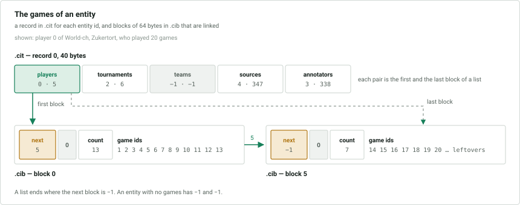
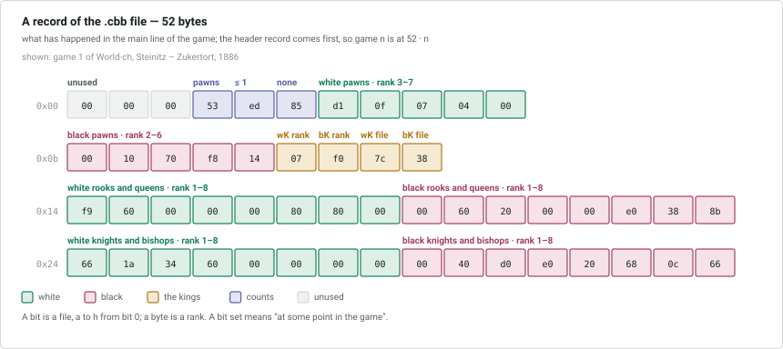

# `.cit` `.cib` `.cit2` `.cib2` `.cbb` `.cbgi` — search boosters

Files that only repeat what the other files already say, in a shape that is quick
to search. ChessBase builds them when a search needs them and keeps them up to
date afterwards. Any of them may be missing, and one that is present may be out of
date: it can stop short of the last games of the database, so a reader must not
rely on them for anything the other files can tell.

| Files | Answer |
|---|---|
| [`.cit` `.cib`](#cit-and-cib--the-games-of-an-entity) | which games refer to a player, tournament, team, source or annotator |
| [`.cit2` `.cib2`](#cit-and-cib--the-games-of-an-entity) | which games carry a game tag |
| [`.cbb`](#cbb--what-happened-in-a-game) | what happened in a game: pawn structure, pieces traded, squares visited |
| [`.cbgi`](#cbgi--the-move-offsets) | where in `.cbg` the moves of a game begin |

## `.cit` and `.cib` — the games of an entity

For each entity, the ids of the games that refer to it, in ascending order. `.cit`
is the table with one record per entity id, and `.cib` holds the lists, cut into
blocks of 64 bytes that are linked together. Both are little-endian. `.cit` and
`.cib` serve players, tournaments, teams, sources and annotators; `.cit2` and
`.cib2` have exactly the same layout and serve game tags.

### `.cit` and `.cit2`

A 12-byte header, then one record per entity id.

| Offset | Size | Type | Description |
|---|---|---|---|
| 0x00 | 4 | int | size of a record: 40 in `.cit`, 8 in `.cit2` |
| 0x04 | 8 | | **unknown**, 0 |

A record of `.cit` is five pairs, in this order:

| Offset | Size | Type | Description |
|---|---|---|---|
| 0x00 | 4 + 4 | int, int | players: first and last block |
| 0x08 | 4 + 4 | int, int | tournaments |
| 0x10 | 4 + 4 | int, int | teams |
| 0x18 | 4 + 4 | int, int | sources |
| 0x20 | 4 + 4 | int, int | annotators |

A record of `.cit2` is the one pair, for game tags.

Record *i* belongs to the entity with id *i* of each type, so the file has as many
records as the largest of the entity files has. A pair is **−1, −1** where the
entity has no games and where the type has no entity *i*.

### `.cib` and `.cib2`

A 12-byte header, then the blocks, the first being block 0.

| Offset | Size | Type | Description |
|---|---|---|---|
| 0x00 | 4 | int | size of a block: 64 |
| 0x04 | 4 | int | number of blocks |
| 0x08 | 4 | int | first unused block, 0 if none |

A block:

| Offset | Size | Type | Description |
|---|---|---|---|
| 0x00 | 4 | int | the next block of the list, −1 for the last |
| 0x04 | 4 | | **unknown**, 0 |
| 0x08 | 4 | int | number of game ids in this block, at most 13 |
| 0x0c | 4 · 13 | int | the game ids; the bytes after the last one are leftovers |

To list the games of an entity, start at the first block of its pair and follow
the next-block links, taking the game ids of each block, until the link is −1. The
last block of the list is the second block of the pair.

The ids in a list are in ascending order across the blocks, and every block but
the last is full. A game that refers to the same entity twice, a player who has
both colours for instance, is in the list twice. A game that is deleted stays in
the lists.

A block that no list uses is **unused**. Unused blocks are chained through their
first field, each naming the next, the last naming 0; the header names the first
of them. A new list takes its blocks from that chain before the file is extended.

## `.cbb` — what happened in a game

A record for each game and guiding text, describing what happens in the **main
line** of the game: which pieces were traded, which squares pawns and pieces have
been on. A search for a position that needs, say, a black pawn on e5 and no white
queen can rule out games from the record alone. Big-endian.

A 52-byte header, then one 52-byte record for each game id, in order; the record
for game 1 comes first.

| Offset | Size | Type | Description |
|---|---|---|---|
| 0x00 | 4 | int | number of records, counting the header |
| 0x04 | 2 | short | 1 |
| 0x06 | 2 | short | size of a record: 52 |
| 0x08 | 44 | | unused, 0 |

The file may continue with zero records past the last one, up to a multiple of
131,072 records.

The record for a guiding text is all zeros. In the description of a record,
**at some point** means in the position before the first move, in the position
after any move of the main line. Where a byte stands for a rank, its bit *b* is
file *b*, with file `a` as 0.

| Offset | Size | Description |
|---|---|---|
| 0x00 | 3 | 0 |
| 0x03 | 1 | bits 0-2: the number of white pawns left at the end, 7 for 7 or 8; bit 3: white at some point had no pieces but pawns and the king; bits 4-6 and bit 7: the same for black |
| 0x04 | 1 | *at most* counts: bit 0: white at some point had no queen; bit 1: at most one rook; bit 2: at most one bishop; bit 3: at most one knight; bits 4-7: the same for black |
| 0x05 | 1 | *none* counts: bit 0: white at some point had no queen; bit 1: no rook; bit 2: no bishop; bit 3: no knight; bits 4-7: the same for black |
| 0x06 | 5 | white pawns: the bytes for rank 3, 4, 5, 6 and 7; bit *b* is set if a white pawn was on that square at some point |
| 0x0b | 5 | black pawns: the bytes for rank 2, 3, 4, 5 and 6 |
| 0x10 | 1 | white king: bit *b* set if it was on rank *b* + 1 |
| 0x11 | 1 | black king: the same |
| 0x12 | 1 | white king: bit *b* set if it was on file *b* |
| 0x13 | 1 | black king: the same |
| 0x14 | 8 | white rooks and queens: the bytes for rank 1 to 8 |
| 0x1c | 8 | black rooks and queens: rank 1 to 8 |
| 0x24 | 8 | white knights and bishops: rank 1 to 8 |
| 0x2c | 8 | black knights and bishops: rank 1 to 8 |

A promoted pawn counts as the piece it became.

Bit 0 of `0x04` and bit 0 of `0x05` are the same, and so are bit 4 of each.

## `.cbgi` — the move offsets

A 4-byte header, the number of games covered as a little-endian `int`, and then a
little-endian `uint` for each game: the offset in `.cbg` where the moves of that
game begin. It is the offset in the game's `.cbh` record, kept where a program can
load it in one go. The value for a guiding text is either 0 or the offset of its
body, depending on the version of ChessBase that wrote the file.

The file may continue with zeros past the last game, up to a multiple of 131,072
entries.

Games with an id above the count in the header are not covered.
