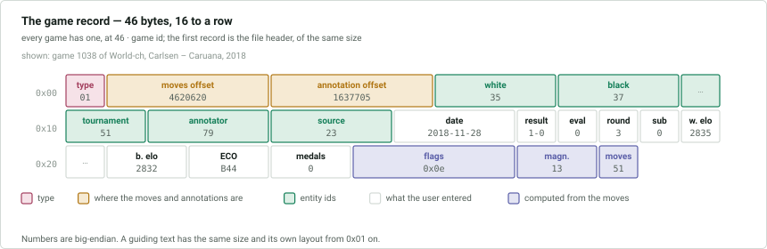
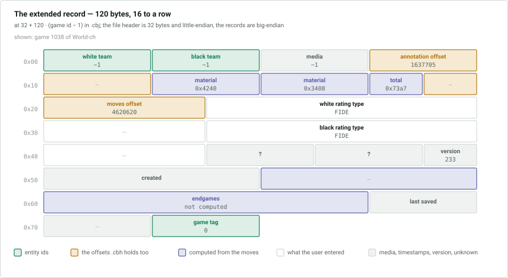

# `.cbh`, `.cbj` and `.flags` — game headers

Three files describe the games. The **`.cbh`** file holds the main header of each
game: where its moves are, who played, the result and the flags. The **`.cbj`**
file holds an extended header with the fields that were added later: teams,
material, ratings, timestamps. The **`.flags`** file holds one more fact about
each game, whether it is a Top Game.

Guiding texts have a record in the same files and share the game ids. The first
game or text has id 1.

## `.cbh` — the main headers

A 46-byte file header is followed by one 46-byte record per game, in game id
order and with no gaps. The record for game *n* starts at `46 · n`. The number of
records is `(file size − 46) / 46`.

### File header

| Offset | Size | Type | Description |
|---|---|---|---|
| 0x00 | 1 | | unknown, always 0 |
| 0x01 | 2 | ushort | number of bytes of this header in use: 44, or 36 in older databases |
| 0x03 | 2 | ushort | record size, 46 |
| 0x05 | 1 | byte | format version, 1 |
| 0x06 | 4 | int | id of the next game to be added |
| 0x0a | 2 | | unknown, always 0 |
| 0x0c | 4 | int | id of the next embedded sound |
| 0x10 | 4 | int | id of the next embedded picture |
| 0x14 | 4 | int | id of the next embedded video |
| 0x18 | 16 | | unknown, always 0 |
| 0x28 | 4 | int | id of the next game to be added, again; 0 if the value at 0x01 is 36 |
| 0x2c | 2 | | unknown, always 0 |

The next game id equals the record count plus 1. The counters for embedded sounds,
pictures and videos are explained in
[6-multimedia.md](6-multimedia.md#embedded-pictures).

### Record kinds

The byte at 0x00 says what the record is:

| Bit | Meaning |
|---|---|
| 0 | always set |
| 1 | the record is a [guiding text](#guiding-text-records) |
| 7 | the record has been marked as deleted |

A deleted game keeps its record and its id.

### Game records

| Offset | Size | Type | Description |
|---|---|---|---|
| 0x00 | 1 | byte | type, above |
| 0x01 | 4 | uint | offset of the moves in `.cbg` |
| 0x05 | 4 | uint | offset of the annotations in `.cba`, 0 if the game has none |
| 0x09 | 3 | uint24 | white player, an entity id |
| 0x0c | 3 | uint24 | black player |
| 0x0f | 3 | uint24 | tournament |
| 0x12 | 3 | uint24 | annotator |
| 0x15 | 3 | uint24 | source |
| 0x18 | 3 | uint24 | played [date](README.md#dates) |
| 0x1b | 1 | byte | [result](#result-and-line-evaluation) |
| 0x1c | 1 | byte | line evaluation, when the result is *line* |
| 0x1d | 1 | byte | round, 0 if not set |
| 0x1e | 1 | byte | subround, 0 if not set |
| 0x1f | 2 | ushort | white elo, 0 if none |
| 0x21 | 2 | ushort | black elo |
| 0x23 | 2 | ushort | [ECO](#eco) or Chess960 start position |
| 0x25 | 2 | ushort | [medals](#medals) |
| 0x27 | 4 | uint | [flags](#flags) |
| 0x2b | 2 | ushort | [annotation magnitudes](#annotation-magnitudes) |
| 0x2d | 1 | byte | number of full moves in the main line, 255 if it has 255 or more |

Entity ids are never −1. A field left blank by the user points at an entity whose
text is empty; see [7-behaviour.md](7-behaviour.md#placeholder-entities).

### Guiding text records

A guiding text is a piece of writing filed among the games; see
[2-moves.md](2-moves.md#guiding-texts) for its content.

| Offset | Size | Type | Description |
|---|---|---|---|
| 0x00 | 1 | byte | type, with bit 1 set |
| 0x01 | 4 | uint | offset of the text in `.cbg` |
| 0x05 | 2 | | unknown, always 0 |
| 0x07 | 3 | uint24 | tournament |
| 0x0a | 3 | uint24 | source |
| 0x0d | 3 | uint24 | annotator, who is the author of the text |
| 0x10 | 1 | byte | round, 0 if not set |
| 0x11 | 1 | byte | subround, 0 if not set |
| 0x12 | 4 | uint | flags; only the embedded audio, picture and video flags can be set |
| 0x16 | 24 | | unknown, always 0 |

The title of a text is not here: it is stored with the text in `.cbg`.

### Result and line evaluation

| Value | Result |
|---|---|
| 0 | 0-1 |
| 1 | ½-½ |
| 2 | 1-0 |
| 3 | line (unfinished) |
| 4 | 0-1 on forfeit |
| 5 | ½-½ on forfeit |
| 6 | 1-0 on forfeit |
| 7 | 0-0, both lost |

When the result is 3 the byte at 0x1c holds a numeric annotation glyph giving the
evaluation of the position, using the standard NAG numbering. It is 0 otherwise.

### ECO

`value / 128 − 1` is the ECO code numbered from 0, so 0-99 are A00-A99, 100-199
B00-B99, and so on to E99. `value % 128` is the sub-ECO, 0-99. A value of 0
means no ECO.

A value of 64576 (`65536 − 960`) or more is not an ECO but a **Chess960 start
position**, `value − 64576`, numbered 0-959.

### Flags

A bitmask. Most bits say that the game carries annotations of a given kind. They
are set when a game is saved, from what the game contains.

| Bit | Meaning | Bit | Meaning |
|---|---|---|---|
| 0x00000001 | starts from a set-up position | 0x00080000 | game quotation |
| 0x00000002 | variations | 0x00100000 | pawn structure |
| 0x00000004 | commentary | 0x00200000 | piece path |
| 0x00000008 | symbols | 0x00400000 | white clock |
| 0x00000010 | coloured squares | 0x00800000 | black clock |
| 0x00000020 | arrows | 0x01000000 | critical position |
| 0x00000080 | time spent | 0x02000000 | correspondence header, likely |
| 0x00000100 | annotation type 8 | 0x04000000 | media annotation, likely |
| 0x00000200 | training | 0x08000000 | unorthodox (Chess960) |
| 0x00010000 | embedded audio, likely | 0x10000000 | web link |
| 0x00020000 | embedded picture | | |
| 0x00040000 | embedded video, likely | | |

The bits not listed are unknown, and the flags marked *likely* have never been
seen set on a game: their meaning is what the older documentation says.

### Medals

A bitmask, one bit each from bit 0: best game, decided tournament, model game,
novelty, pawn structure, strategy, tactics, with attack, defence, sacrifice,
material, piece play, endgame, tactical blunder, strategical blunder, user.

ChessBase shows sacrifice before defence, but the file stores defence first.

### Annotation magnitudes

A bitmask qualifying some of the flags with a rough size for that kind of
annotation. A bit is only meaningful when its flag is set; a bit for a flag that
is not set may be stray.

| Bit | Flag | Set when |
|---|---|---|
| 0-1 | variations | the variation magnitude; see below |
| 2 | commentary | the text comes to more than 200 bytes |
| 3 | symbols | the game has 10 or more symbol annotations |
| 4 | coloured squares | 10 or more coloured-square annotations |
| 5 | arrows | 6 or more arrow annotations |
| 7 | time spent | 10 or more time-spent annotations |
| 9 | training | 6 or more training annotations |

What is counted is the number of **annotations**, not the number of symbols,
squares or arrows inside them. Commentary is counted in **bytes** of text, summed
over every text annotation, before the move and after it, and including the game
text that belongs to no move.

Bits 0-1 hold the **variation magnitude**, from 0 to 3, standing for the number
of plies in variations: up to 50, up to 300, up to 1000, and more.

## `.cbj` — the extended headers

The file was added after the `.cbh` file and its records have grown since; a
database made by an old version has short records. It starts with a 32-byte
header, followed by one record per game or guiding text in game id order, so game
*n*'s record starts at `32 + record size · (n − 1)`. The header is little-endian
and the records are big-endian.

| Offset | Size | Type | Description |
|---|---|---|---|
| 0x00 | 4 | int | version, below |
| 0x04 | 4 | int | record size |
| 0x08 | 4 | int | number of records |
| 0x0c | 20 | | unused, and may hold leftover bytes |

The number of records is normally the next game id in the `.cbh` header less 1,
but may be lower; a game without a record has the default values of every field.

The record size follows from the version:

| Version | Record size |
|---|---|
| 1 | 8 |
| 5 | 30 |
| 6 | 38 |
| 7 | 74 |
| 8 | 78 |
| 11 | 120 |

When a database with a short record size is saved, ChessBase rewrites the whole
file at the newest size and gives the new fields default values. A record has
every field that fits within its size.

### Records

| Offset | Size | Type | Description |
|---|---|---|---|
| 0x00 | 4 | int | white team, −1 if none |
| 0x04 | 4 | int | black team, −1 if none |
| 0x08 | 4 | int | offset in `.cbm` of the media a guiding text uses, −1 if none |
| 0x0c | 8 | long | offset of the annotations in `.cba`, as in the `.cbh` record |
| 0x14 | 4 | int | [final material](#final-material), the greater of the two |
| 0x18 | 4 | int | final material, the lesser |
| 0x1c | 2 | ushort | total material |
| 0x1e | 8 | long | offset of the moves in `.cbg`, as in the `.cbh` record |
| 0x26 | 16 | | white [rating type](#rating-type) |
| 0x36 | 16 | | black rating type |
| 0x46 | 4 | | unknown |
| 0x4a | 4 | | unknown |
| 0x4e | 2 | ushort | version, increased by one each time the game is saved |
| 0x50 | 8 | long | creation [timestamp](README.md#timestamps) |
| 0x58 | 20 | | [endgame information](#endgame-information) |
| 0x6c | 8 | long | last-saved timestamp |
| 0x74 | 4 | int | game tag, −1 if none |

Team ids are 0-based like other entity ids, but a game with no team uses −1 where
the `.cbh` file would point at an empty entity. A game with no game tag refers
either to −1 or to game tag 0, the tag with no titles.

The creation timestamp is stamped once, when the game is created, and is carried
to a copy of the game in another database.

### Final material

The material a player has left at the end of the game, packed into one value:

| Bits | Piece |
|---|---|
| 0-2 | rooks |
| 3-5 | bishops |
| 6-8 | knights |
| 9-11 | queens |
| 12-15 | pawns |

Bits 16-31 are zero. Both values are 0 when the material has not been computed,
which is also what a game ending with bare kings gives; some records hold −1 in
both fields instead.

The two values are **not white and black**. The greater is at 0x14 and the lesser
at 0x18. Since pawns occupy the highest bits, the side with more pawns is
normally first. Storing them ordered lets a material search match either colour.

The total at 0x1c is normally the two values added, less 2, wrapping at 16 bits,
so it is 0xfffe when both are 0. It is not reliable, since other values also
occur.

### Rating type

Each elo in the `.cbh` record has a 16-byte record that says what kind of rating
it is.

| Offset | Size | Type | Description |
|---|---|---|---|
| 0x00 | 1 | | unknown, always 0 |
| 0x01 | 1 | byte | the kind: 1 international, 2 national; other bits may be set |
| 0x02 | 1 | byte | time control of a national rating, see below |
| 0x03 | 1 | byte | for an international rating, its time control plus 1; for a national rating 100 |
| 0x04 | 1 | byte | nation, for a national rating; 0 otherwise |
| 0x05 | 11 | | the name of the rating, a string |

An international rating is normally kind 1, time control 1 (normal) and the name
`FIDE`. A national rating is kind 2, with the nation and no name. The time
controls are 0 normal, 1 blitz, 2 rapid and 3 correspondence for a national
rating, and one higher for an international one. An international rating at the
correspondence time control is named `ICCF` rather than `FIDE`.

An elo of 0 means the player has no rating. When the kind is 0 the rest of the
record has no meaning and may hold leftover bytes.

### Endgame information

Twenty bytes recording the kinds of endgame the game passed through, and when.
They are zero unless ChessBase has computed them.

| Offset | Size | Type | Description |
|---|---|---|---|
| 0x00 | 2 | ushort | 1 when the information is present |
| 0x02 | 2 | ushort | the endgame type that lasted longest |
| 0x04 | 4 × 4 | | up to four endgames: a type, then the ply at which it began, 2 bytes each |

An unused entry is zero. The endgame types are numbers whose meaning is
**unknown**.

## `.flags` — Top Games

A 12-byte header, all big-endian, followed by two bits per game.

| Offset | Size | Type | Description |
|---|---|---|---|
| 0x00 | 4 | | `0f 01 0b 09` |
| 0x04 | 4 | int | capacity: the number of 32-bit words in the body |
| 0x08 | 4 | int | bits per game, normally 2 |

The bits of game *g* are bits `2g` and `2g + 1` of the body, counting from the
least significant bit of the first byte; game 0 does not exist and its bits are
not used. Of the two bits of a game, the higher says that ChessBase has
evaluated whether the game is a Top Game, and the lower is set if it is one.

The body has room for more games than exist, and the unused bits are 0. A file
with 3 bits per game exists; its third bit is 0.
