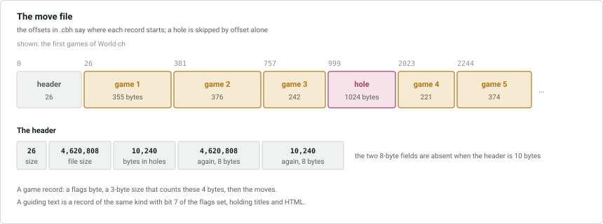

# `.cbg` — moves

Holds the moves of every game and the body of every guiding text. A 26-byte file
header is followed by one record per game or text, in game id order. The record
for a game is found through the offset at 0x01 of its `.cbh` record, and again at
0x1e of its `.cbj` record; there is no index in the file itself.

Records are stored one after the other, each starting where the previous one
ended, except that a record that has become shorter leaves a **hole** behind it.
The offsets in `.cbh` and `.cbj` are how the holes are skipped.

## File header

| Offset | Size | Type | Description |
|---|---|---|---|
| 0x00 | 2 | ushort | header size, 26; 10 in old databases |
| 0x02 | 4 | uint | size of the file |
| 0x06 | 4 | uint | number of unused bytes in the holes between records; a little lower than the sum of the holes |
| 0x0a | 8 | long | size of the file, again |
| 0x12 | 8 | long | number of unused bytes, again |

The two fields from 0x0a on are absent when the header is 10 bytes. The `.cba`
file has the same header.

## Game records

| Offset | Size | Type | Description |
|---|---|---|---|
| 0x00 | 1 | byte | flags, below |
| 0x01 | 3 | uint24 | size of the record in bytes, including these 4 |
| 0x04 | 28 | | the start position, only if bit 6 of the flags is set |
| … | | | the moves, to the end of the record |

The flags:

| Bits | Meaning |
|---|---|
| 7 | set in every guiding text; in a game its meaning is **unknown** |
| 6 | the game does not start from the usual position, which is given explicitly |
| 0-5 | the [encoding mode](#encoding-modes) |

### Start position

| Offset | Size | Type | Description |
|---|---|---|---|
| 0x00 | 1 | | 1 |
| 0x01 | 1 | | bits 0-3: en passant file, 0 for none and 1-8 for `a`-`h`; bit 4: side to move, 0 white and 1 black |
| 0x02 | 1 | | castling rights: bit 0 white O-O-O, bit 1 white O-O, bit 2 black O-O-O, bit 3 black O-O |
| 0x03 | 1 | | the move number; 0 and 1 both mean move 1 |
| 0x04 | 24 | | the board |

The board is a stream of 192 bits, most significant bit of the first byte first,
listing the 64 squares in the order `a1`, `a2`, … `a8`, `b1`, … `h8`. An empty
square is a single 0 bit. An occupied one is a 1 bit, a colour bit (0 white, 1
black) and 3 bits for the piece:

| Piece | Bits |
|---|---|
| king | 001 |
| queen | 010 |
| knight | 011 |
| bishop | 100 |
| rook | 101 |
| pawn | 110 |

At most 32 pieces fit in the 192 bits, and the stream is padded with zero bits.
For example the bytes `58 0e 93` are the bits `010110000000111010010011`, which
read as an empty square, a white pawn (`10110`), six empty squares, a black rook
(`11101`), two empty squares and a white knight (`10011`): a white pawn on `a2`,
a black rook on `b1` and a white knight on `b4`.

The order in which the pieces are found on the board decides which is the "first
rook", the "second bishop" and so on, and which pawn is the "a-pawn"; see
[the moves](#the-compact-encoder).

A game in [encoding mode](#encoding-modes) 10 or 11, which is a Chess960 game,
always has a start position, and 8 more bytes follow the board:

| Offset | Size | Type | Description |
|---|---|---|---|
| 0x00 | 1 | byte | square of the white king |
| 0x01 | 1 | byte | square of the black king |
| 0x02 | 1 | byte | square of the white rook on the king's side |
| 0x03 | 1 | byte | square of the white rook on the queen's side |
| 0x04 | 1 | byte | square of the black rook on the king's side |
| 0x05 | 1 | byte | square of the black rook on the queen's side |
| 0x06 | 2 | ushort | the Chess960 start position, 0-959 |

Castling in such a game needs the six squares. In a very few games the eight bytes
hold no valid squares and no start position number, and how such a game is read is
**unknown**.

## Encoding modes

The moves are a stream of bytes, and how they are read depends on the
**encoding mode**, the low 6 bits of the flags.

| Mode | Encoder | Modifier | Order | Game |
|---|---|---|---|---|
| 0 | compact | pre | default | ordinary chess |
| 1 | simple | pre | default | ordinary chess |
| 2 | compact | pre | reverse | ordinary chess |
| 3 | simple | pre | reverse | ordinary chess |
| 4 | compact | post | default | ordinary chess |
| 5 | simple | post | default | ordinary chess |
| 6 | compact | post | reverse | ordinary chess |
| 7 | simple | post | reverse | ordinary chess |
| 8 | compact | post | default | losing chess |
| 9 | compact | post | reverse | losing chess |
| 10 | compact | post | default | Chess960 |
| 11 | compact | post | reverse | Chess960 |
| 12-19 | | | | other variants, **unknown** |
| 63 | | | | illegal positions allowed, **unknown** |

Nearly every game uses mode 0. Mode 10 is used for Chess960.

Every byte of the stream is first **translated**, to hide the format. A mode has
its own translation table, a permutation of the values 0-255, and the byte is
taken through it together with a counter *n*, the number of moves decoded so far
in the game:

- with the **pre** modifier: `value = table[(byte − n) mod 256]`;
- with the **post** modifier: `value = (table[byte] − n) mod 256`.

The counter starts at 0 and counts every move, variations included and never
reset when a variation ends. A null move counts, and so does a move written in
two bytes; the markers do not. Both bytes of a two-byte move are translated with
the same *n*.

The tables of the modes in use are at [the end of this document](#translation-tables).
The **order** says which piece is the "first" one: in the reverse order the board
is mirrored, so the first rook is the one on `h1` or `h8` and the "a-pawn" is the
one starting on the `h` file.

## The compact encoder

After translation, a byte is a code that says which piece moves and how. A
piece is named by its number among the pieces of its kind that the player has,
and the pieces of a kind are numbered in the order they are found when the squares
of the start position are scanned from `a1` upward: `a1`, `a2`, … `a8`, `b1`, …
`h8` (from `h8` downward in the reverse order). From the usual start position the
first rook is therefore the one on `a1` for white and `a8` for black, and the
"a-pawn" is the pawn that starts on the `a` file; from any other start position
the pawns are simply numbered in the order they are found, whatever their files.

When a piece other than a pawn is captured, the pieces of its kind above it move
down one: if the first bishop is captured the second becomes the first, and the
third, if any, becomes the second. A pawn keeps its number for the whole game,
wherever it moves and whatever is captured. At most three pieces of a kind are
named this way: the moves of a fourth or later piece of a kind, which a promotion
can create, are written in two bytes. En passant is written as an ordinary pawn
capture.

A move is a movement relative to the square the piece is on, `(x, y)`, with
`a1` being `(0, 0)` and `h8` `(7, 7)`, and every coordinate is taken **modulo 8**.
A queen on `c2`, at `(2, 1)`, that moves by `(+7, 0)` reaches `(9 mod 8, 1)`,
which is `b2`.

| Code | Piece | Movement |
|---|---|---|
| 0 | | null move |
| 1-8 | king | `(0,+1)` `(+1,+1)` `(+1,0)` `(+1,−1)` `(0,−1)` `(−1,−1)` `(−1,0)` `(−1,+1)` |
| 9 | king | castles short |
| 10 | king | castles long |
| 11-38 | 1st queen | 7 steps up `(0,+1)…(0,+7)`, then 7 steps right `(+1,0)…(+7,0)`, then 7 up-right `(+i,+i)`, then 7 down-right `(+i,−i)` |
| 39-52 | 1st rook | 7 steps up, then 7 steps right |
| 53-66 | 2nd rook | as the first rook |
| 67-80 | 1st bishop | 7 steps up-right, then 7 down-right |
| 81-94 | 2nd bishop | as the first bishop |
| 95-102 | 1st knight | `(+2,+1)` `(+1,+2)` `(−1,+2)` `(−2,+1)` `(−2,−1)` `(−1,−2)` `(+1,−2)` `(+2,−1)` |
| 103-110 | 2nd knight | as the first knight |
| 111-142 | pawns | four codes for each pawn from the `a` pawn to the `h` pawn, below |
| 143-170 | 2nd queen | as the first queen |
| 171-198 | 3rd queen | as the first queen |
| 199-212 | 3rd rook | as the first rook |
| 213-226 | 3rd bishop | as the first bishop |
| 227-234 | 3rd knight | as the first knight |
| 235 | | the next two bytes describe a move |
| 236 | | ignored |
| 237-253 | | not used |
| 254 | | a variation starts |
| 255 | | a variation ends |

The four codes of a pawn are one step forward, two steps forward, a capture
towards the player's right and a capture towards the left. For white forward is
`(0,+1)` and the right capture is `(+1,+1)`; for black forward is `(0,−1)` and the
right capture is `(−1,−1)`. The left captures are `(−1,+1)` for white and
`(+1,−1)` for black.

Castling by the king codes 9 and 10 moves the rook as well. In a Chess960 game it
is written in two bytes instead.

### Moves in two bytes

Code 235 is followed by two more bytes, taken through the translation like any
other and read together as a big-endian 16-bit value:

| Bits | Description |
|---|---|
| 0-5 | the square the piece moves from |
| 6-11 | the square it moves to |
| 12-13 | the piece a pawn promotes to: 0 queen, 1 rook, 2 bishop, 3 knight |

Any move can be written this way, but only promotions and the moves of a fourth
piece have to be. In a Chess960 game castling is written with the source and the
destination the same: the square the king ends on, `g1` or `g8` for the short
side and `c1` or `c8` for the long side.

### Variations

The move tree is written depth first, the main line first at every position. A
position with more than one move to come from it has **254** written before each
move but the last, and **255** ends a line, so there is always one more 255 than
254, and the last byte of the game is a 255. A 254 means "remember this position";
a 255 means "go back to the last remembered position, or if there is none the game
is over".

For example

    1. e4 c5 (1... c6 2. d4) (1... Nf6 2. e5) 2. Nf3 d6 (2... Nc6 3. Bb5) 3. d4

is written

    e4 254 c5 Nf3 254 d6 d4 255 Nc6 Bb5 255 254 c6 d4 255 Nf6 e5 255

where each move stands for its code. After `e4` the position has three moves to
come, `c5`, `c6` and `Nf6`, so the first two have a 254 before them. After `Nf3`
there are two, `d6` and `Nc6`. The 255 after `d4` returns to the position after
`Nf3`, where `Nc6 Bb5` follows; the next 255 returns to the position after `e4`,
where the 254 remembers it once more for `c6`.

## The simple encoder

Every move is two bytes, each taken through the translation, read together as a
big-endian 16-bit value:

| Bits | Description |
|---|---|
| 0-5 | the square the piece moves from |
| 6-11 | the square it moves to |
| 12-13 | the piece a pawn promotes to, as above; only for a pawn reaching the last rank |
| 14 | a variation ends after this move |
| 15 | a variation starts before this move |

In the reverse order the two squares are swapped. A move from `a1` to `a1` is a
null move. There is no end marker: the last move of the game has bit 14 set. An
empty game has no moves at all.

## Guiding texts

A guiding text's record starts with the flags byte `80` and the 3-byte size, like
a game's, and carries the text in one or more languages. The integers from 0x04 on
are **little-endian**.

| Offset | Size | Type | Description |
|---|---|---|---|
| 0x00 | 1 | byte | flags, 0x80 |
| 0x01 | 3 | uint24 | size of the record in bytes, big-endian |
| 0x04 | 2 | ushort | text format version, below |
| 0x06 | 2 | ushort | number of titles, which may be 0 |
| 0x08 | … | | the titles |
| … | 1 | | unknown, 0 or 1 |
| … | 2 | ushort | number of contents |
| … | … | | the contents |

Each title:

| Size | Type | Description |
|---|---|---|
| 2 | ushort | language, below |
| 2 | ushort | length of the title in bytes |
| *n* | | the title, in ISO 8859-1 |

The languages are numbered 0 English, 1 German, 2 French, 3 Spanish, 4 Italian,
5 Dutch and 6 Portuguese, and 7 for a text that is in no particular language. The
contents can be in more or fewer languages than the titles.

The format of each content depends on the version:

| Version | Content |
|---|---|
| 1 | plain text: a `ushort` language, a `ushort` length, the text, then a `ushort` length of formatting data and that data, which is **unknown** |
| 2 | as 1, with `uint` lengths in place of `ushort` |
| 3 | HTML: a `ushort` language, a `uint` length, the HTML, and 4 zero bytes |

Version 3 is what ChessBase writes. The encoding of the text is not stated: it is
a single-byte code page or UTF-8, and a reader should try UTF-8 first and fall
back to Windows-1252. The media a text refers to are listed in
[6-multimedia.md](6-multimedia.md).

## Translation tables

Each table is a permutation of 0-255: `table[i]` is in the row `i >> 4` and the
column `i & 15`. They are the tables that turn a byte of the stream into a code
or a square, as described above.

The tables of the other modes are not given here.

**Mode 0**

        _0 _1 _2 _3 _4 _5 _6 _7 _8 _9 _a _b _c _d _e _f
    0_  a2 95 43 f5 c1 3d 4a 6c 53 83 cc 7c ff ae 68 ad
    1_  d1 92 8b 8d 35 81 5e 74 26 8e ab ca fd 9a f3 a0
    2_  a5 15 fc b1 1e ed 30 ea 22 eb a7 cd 4e 6f 2e 24
    3_  32 94 41 8c 6e 58 82 50 bb 02 8a d8 fa 60 de 52
    4_  ba 46 ac 29 9d d7 df 08 21 01 66 a3 f1 19 27 b5
    5_  91 d5 42 0e b4 4c d9 18 5f bc 25 a6 96 04 56 6a
    6_  aa 33 1c 2b 73 f0 dd a4 37 d3 c5 10 bf 5a 23 34
    7_  75 5b b8 55 d2 6b 09 3a 57 12 b3 77 48 85 9b 0f
    8_  9e c7 c8 a1 7f 7a c0 bd 31 6d f6 3e c3 11 71 ce
    9_  7d da a8 54 90 97 1f 44 40 16 c9 e3 2c cb 84 ec
    a_  9f 3f 5c e6 76 0b 3c 20 b7 36 00 dc e7 f9 4f f7
    b_  af 06 07 e0 1a 0a a9 4b 0c d6 63 87 89 1d 13 1b
    c_  e4 70 05 47 67 7b 2f ee e2 e8 98 0d ef cf c4 f4
    d_  fb b0 17 99 64 f2 d4 2a 03 4d 78 c6 fe 65 86 88
    e_  79 45 3b e5 49 8f 2d b9 be 62 93 14 e9 d0 38 9c
    f_  b2 c2 59 5d b6 72 51 f8 28 7e 61 39 e1 db 69 80

**Mode 4**

        _0 _1 _2 _3 _4 _5 _6 _7 _8 _9 _a _b _c _d _e _f
    0_  58 a3 ee 72 47 b9 1f a0 26 fd dc 6d f1 e3 cb c5
    1_  e2 d0 29 e7 89 e1 ae 7b 34 41 35 4b a5 7c f6 e5
    2_  db 8c 5f 37 05 bb 32 54 4c ef 5d 2a 7f d3 81 86
    3_  df 18 c3 44 16 f7 85 0f 4d 30 79 14 45 aa a2 6c
    4_  15 92 a6 62 48 19 e9 3c 38 94 28 a8 66 09 03 63
    5_  20 7d 36 d7 2e 98 ec da 01 13 24 73 cd 9e cf d9
    6_  d5 68 8b d2 ab 5b 69 b0 27 fc 31 1b 53 7e 65 76
    7_  55 75 af 0a cc c7 c4 b2 b5 22 e8 a7 be f5 00 5a
    8_  21 d1 74 8e de 9c e4 42 2b b1 9b 93 c1 78 70 d6
    9_  b6 ad 4e 6a 64 7a 57 49 11 9d 12 c0 3a 2f e6 84
    a_  c6 07 ce 08 82 04 90 b8 87 ca 6e 1e 40 1a 50 b4
    b_  10 bc 43 8a 71 0b 8d 5c 3b 3f 88 ba f4 f3 61 1d
    c_  f9 fe 25 51 0d eb c8 59 17 46 a4 f2 56 b7 02 2d
    d_  33 9f d8 83 fb bf ea ed ac 60 67 39 dd 96 6b a9
    e_  c2 77 0c 0e 91 fa 99 9a e0 a1 f0 5e c9 06 4f bd
    f_  52 80 d4 f8 97 23 3e 1c 2c 95 4a 8f 3d 6f ff b3

**Mode 5**

        _0 _1 _2 _3 _4 _5 _6 _7 _8 _9 _a _b _c _d _e _f
    0_  e0 1b 97 86 a2 48 f0 23 01 37 fa eb 50 76 5d cd
    1_  80 1a 31 5c ff bc 78 da e5 a3 75 b3 71 e1 a1 0e
    2_  56 41 3f e3 0d c4 25 e6 88 89 70 dc 99 a6 0b 9a
    3_  14 2c 57 9e 69 7a df 55 ad 73 7c c5 03 72 f5 45
    4_  62 8e af 5f cc c0 5e f3 18 13 b5 38 09 28 3c bd
    5_  10 8b e9 dd 8c 94 08 81 a7 fe 24 79 44 2b c1 36
    6_  32 7f 67 e4 fd 49 4b 21 a9 5b 77 1f 1c f6 40 65
    7_  3d f9 5a f8 47 26 53 d4 20 d2 d8 4f 27 ae fb b6
    8_  9b 74 b8 42 fc 16 6f d7 9f b9 7b 60 de c2 46 06
    9_  9c d3 2a c7 05 85 3e b1 00 15 d1 96 ce 90 95 11
    a_  33 8f c6 82 84 b7 39 a0 e8 34 1e 7d a8 d0 ea e2
    b_  ef 4c c3 58 4e 02 1d b2 7e 98 2d 07 d5 ca 68 cb
    c_  30 b4 ac 83 63 ec 87 ee 2e be cf 6d 4d 8a d6 04
    d_  b0 35 c8 c9 12 17 61 8d 64 0f a5 54 29 3a 4a 6b
    e_  bb 2f d9 3b 93 6a aa a4 22 f4 19 43 6e f1 f7 db
    f_  92 ed 66 59 0a bf 6c 51 91 52 f2 0c 9d ab ba e7

**Mode 10**

        _0 _1 _2 _3 _4 _5 _6 _7 _8 _9 _a _b _c _d _e _f
    0_  38 50 64 cc 9f 56 6f 73 4d 41 66 a2 c6 b9 96 47
    1_  ee cf b1 6d 48 4f 44 20 15 be 82 09 34 99 eb 1a
    2_  33 7c ab 59 00 22 24 b0 b4 fa 85 dd 57 f3 d9 d2
    3_  8a 8d 70 b5 6e 43 a7 0b 27 08 ea b3 94 1c 63 1b
    4_  2b c5 0c d4 3f 37 e8 de a6 23 ef 06 fd 3e c1 40
    5_  32 df 2d c8 d0 0f f1 e2 7a 95 ec 3c ca 49 11 e0
    6_  25 d8 30 fe 2e ba dc aa 53 4c d1 5e 67 8b 0d 9e
    7_  a9 bf 05 78 35 c4 b6 a4 4b d6 04 52 a8 76 2c bd
    8_  ae 39 b2 e3 03 81 17 9a 3d 68 c0 65 92 c9 f7 77
    9_  16 ff f5 e1 1e 36 bb 86 8e f9 9d d5 6b f4 74 80
    a_  2f 7b 14 97 29 e5 4a 02 93 5c cb a1 58 79 f8 5f
    b_  26 28 8f 7e a5 ed d3 89 c7 88 9b 54 87 60 da f0
    c_  45 3a c2 84 90 21 f6 f2 5a 2a 55 18 61 01 fb e6
    d_  8c 6a 12 b8 62 83 98 10 71 5b e4 ad db 42 0a cd
    e_  46 d7 72 07 ce 19 b7 3b 31 9c 51 c3 69 a3 91 e9
    f_  0e 1f fc 75 6c 1d 7d e7 af 5d a0 bc 13 7f ac 4e
