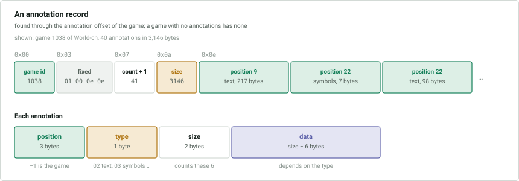

# `.cba` — annotations

Holds the annotations of every game: comments, symbols, arrows, evaluations and
the rest. A 26-byte file header, the same as that of [`.cbg`](2-moves.md#file-header),
is followed by one record for each game that has annotations, back to back. The
record for a game is found through the offset at 0x05 of its `.cbh` record, and
again at 0x0c of its `.cbj` record. **A game without annotations has no record**
and its offset is 0. Guiding texts have none.

## Records

| Offset | Size | Type | Description |
|---|---|---|---|
| 0x00 | 3 | uint24 | the game id |
| 0x03 | 4 | | `01 00 0e 0e` |
| 0x07 | 3 | uint24 | number of annotations plus 1 |
| 0x0a | 4 | uint | size of the record in bytes, including this header |
| 0x0e | … | | the annotations |

Each annotation:

| Offset | Size | Type | Description |
|---|---|---|---|
| 0x00 | 3 | int24 | the [position](#positions) |
| 0x03 | 1 | byte | the [type](#types) |
| 0x04 | 2 | ushort | size of the annotation in bytes, including these 6 |
| 0x06 | … | | the data |

The annotations of a game are in ascending order of position, and those on the
same position keep a meaningful order that a reader should preserve. An unknown
type can be skipped with its size.

### Positions

Position −1 is the game as a whole, before the first move. Otherwise a position
counts the moves of the game from 0, in the order they are stored in
[`.cbg`](2-moves.md#the-compact-encoder): depth first, at each position the moves
in the order written, so that the main line comes first and every variation
follows the main line it branches from.

In `1.e4 c5 (1...c6 2.d4) 2.Nf3` the positions are e4 0, c5 1, Nf3 2, c6 3, d4 4.

## Types

| Type | Name | Data |
|---|---|---|
| `02` | text after move | [below](#text) |
| `82` | text before move | as `02` |
| `03` | symbols | 1-3 bytes, [below](#symbols) |
| `04` | coloured squares | pairs of bytes, [below](#squares-and-arrows) |
| `05` | arrows | triples of bytes, [below](#squares-and-arrows) |
| `07` | time spent | 4 bytes: hours, minutes, seconds, and a byte that is **unknown** |
| `08` | **unknown** | 4 bytes |
| `09` | training | [below](#training) |
| `13` | game quotation | [below](#game-quotation) |
| `14` | pawn structure | 1 byte |
| `15` | piece path | 2 bytes, **unknown** |
| `16` | white clock | `int`: the time left in hundredths of a second |
| `17` | black clock | as `16`, for black |
| `18` | critical position | 1 byte: 1 opening, 2 middlegame, 3 endgame |
| `1a` | **unknown** | 10 bytes, on position −1 |
| `1c` | web link | **unknown** |
| `20` | video | **unknown** |
| `21` | computer evaluation | 3 little-endian `short`s: the evaluation in centipawns, or moves to mate; 0 for an ordinary evaluation and 1 for mate; the search depth |
| `22` | medals | `int`: the same bits as the [medals](1-game-headers.md#medals) of the header |
| `23` | variation colour | 4 bytes: a flags byte, then blue, green and red; bit 0 of the flags is *only the main line* and bit 1 is *only the moves* |
| `24` | time control | [below](#time-control) |
| `25` | video stream time | `int` |
| `26` | evaluations | [below](#evaluations) |

Sound, picture and correspondence annotations are referred to by the
[flags](1-game-headers.md#flags) but are **unknown**: no type is known for them.
Nothing more is known of types `08` and `1a`.

The types `16`, `17`, `1a`, `24` and `26` are only ever on position −1; the rest
are on moves, and a few on position −1 as well.

### Text

| Size | Type | Description |
|---|---|---|
| 1 | | **unknown**, usually 0 |
| 1 | byte | the language, as a [nation code](README.md#nation-codes); 0 for any language |
| … | | the text, to the end of the annotation |

Type `02` is shown after the move and `82` before it. The text is a run of bytes
in a single-byte code page or in UTF-8, and nothing says which; a reader should
try UTF-8 first and fall back to Windows-1252. The byte `9e` is ChessBase's
marker for a diagram, shown as `{#}`.

### Symbols

Up to three bytes, each a [NAG](README.md#symbols), in this order:

| Byte | Meaning |
|---|---|
| 0 | the symbol on the move: `!` `?` `!!` `??` `!?` `?!` and the like |
| 1 | the evaluation of the position: `=`, `+/=`, `+-`, unclear, and the like, as well as comments such as *novelty*, *with initiative* and *with attack* |
| 2 | a prefix: *editorial*, *better is*, *worse is*, *with the idea*, *directed against* |

Trailing zero bytes are left out, so an annotation may be 1, 2 or 3 bytes long.

### Squares and arrows

Both are a list running to the end of the annotation.

| Type | Item | Size |
|---|---|---|
| `04` | colour, square | 2 |
| `05` | colour, from square, to square | 3 |

The colours are 2 green, 3 yellow and 4 red; a few other values occur, which are
**unknown**. Here **the squares are numbered from 1**: `a1` is 1, `a2` is 2, `b1` is 9 and `h8` is 64.

### Time control

Thirty-three bytes, three *series* of 11 bytes, all big-endian:

| Size | Type | Description |
|---|---|---|
| 4 | int | initial time in hundredths of a second |
| 4 | int | increment in hundredths of a second |
| 2 | short | number of moves the series lasts, 1000 for the rest of the game |
| 1 | byte | type of series, below |

A series that is not used is all zeros, or holds no time and 1000 moves with type 5.

| Type | Series |
|---|---|
| 0 | the rest of the game, with no increment |
| 1 | a stage of a set number of moves |
| 3 | the rest of the game, with an increment |
| 5 | no time and 1000 moves, after a series of type 0 or 3 |
| 2 | **unknown** |

### Evaluations

Engine evaluations for the moves of the main line, on position −1.

| Size | Type | Description |
|---|---|---|
| 2 | ushort | number of entries |
| 4 · *n* | | the entries |

Each entry:

| Size | Type | Description |
|---|---|---|
| 1 | byte | 0 ordinary, `ff` none, 1 mate; other values are **unknown** |
| 1 | byte | search depth |
| 2 | short | evaluation in centipawns, or moves to mate |

There is one entry for the position before the first move and one for each move.

### Training

A training question. Its layout is only partly known.

| Size | Type | Description |
|---|---|---|
| 3 | | `01 00 01` |
| 2 | ushort | number of bytes that follow, little-endian |
| 4 | int | time allowed in seconds, little-endian |
| 2 | short | points, little-endian |
| … | | the question and solutions, **unknown** in detail |

### Game quotation

A game quoted in a comment, with a header of its own and optionally its moves.
Only the beginning is known.

| Size | Type | Description |
|---|---|---|
| 2 | ushort | size of the data |
| 2 | ushort | 1 for the header alone, 2 for the header and the moves |
| 2 | | **unknown** |
| … | | the names of white and black, each a length byte, the text as `last,first`, and a zero |
| … | | the rest of the header and the moves, **unknown** |
