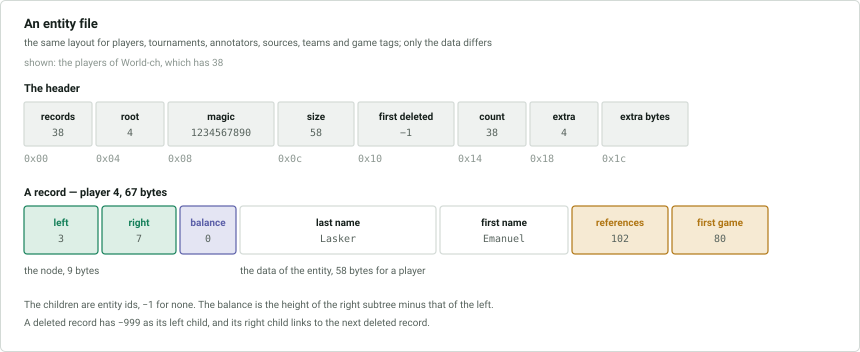
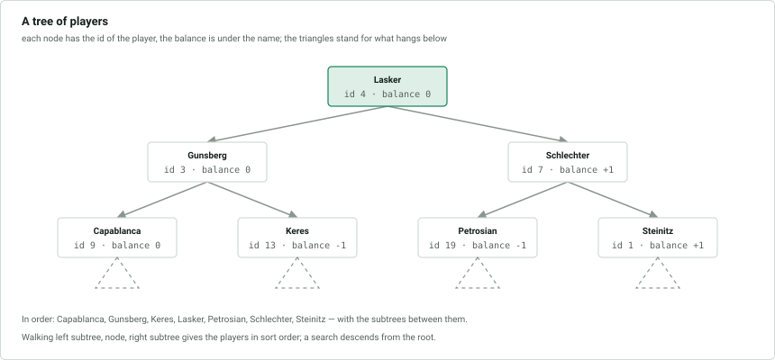

# `.cbp` `.cbt` `.cbtt` `.cbc` `.cbs` `.cbe` `.cbl` — entities

Everything a game header refers to by id is an **entity**: players, tournaments,
annotators, sources, teams and game tags. Each type is kept in a file of its own,
and all the files are built the same way: a small header, then one record per
entity, in which the entities are also the nodes of a balanced binary tree that
keeps them in sorted order.

| Type | File | Data size | Record size | Sorted by |
|---|---|---|---|---|
| player | `.cbp` | 58 | 67 | [last name, first name](#sort-order) |
| tournament | `.cbt` | 90 | 99 | year descending, title, place, month, day |
| annotator | `.cbc` | 53 | 62 | name |
| source | `.cbs` | 59 | 68 | title |
| team | `.cbe` | 63 | 72 | title, team number, season, year, nation |
| game tag | `.cbl` | 1608 | 1617 | the titles |

An entity id is the 0-based position of its record in the file. An annotator is
not a player, and has an id space of its own.

## Entity files

A file header of 28 or 32 bytes is followed by the records, back to back. All
integers are little-endian.

| Offset | Size | Type | Description |
|---|---|---|---|
| 0x00 | 4 | int | number of records in the file, counting deleted ones |
| 0x04 | 4 | int | id of the root of the tree; 0 or −1 if the tree is empty |
| 0x08 | 4 | int | 1234567890 |
| 0x0c | 4 | int | size of the data of a record, not counting its first 9 bytes |
| 0x10 | 4 | int | id of the first deleted record, −1 if none |
| 0x14 | 4 | int | number of entities, not counting deleted ones |
| 0x18 | 4 | int | number of extra bytes in the header: 0, or 4 |
| 0x1c | 4 | | the extra bytes, if any; they may hold leftovers |

Each record begins with the node of the tree:

| Offset | Size | Type | Description |
|---|---|---|---|
| 0x00 | 4 | int | id of the left child, −1 if none |
| 0x04 | 4 | int | id of the right child, −1 if none |
| 0x08 | 1 | byte | balance: the height of the right subtree minus that of the left, −1, 0 or 1 |
| 0x09 | … | | the data of the entity, below |

Every entity type ends its data with two `int`s:

- the **number of references** to the entity, from games and from guiding texts.
  A game that refers to the same entity twice, as when a player has both colours,
  counts twice;
- the **id of the first game** or text that refers to it.

### The tree

The entities form an AVL tree. Walking it in order, left subtree, node, right
subtree, from the root named in the header gives the entities in their sort order,
and a search for a given entity is a descent from the root.

### Deleted records

A record cannot be removed from the middle of the file, so a deleted entity keeps
its record and is marked: its left child is **−999** and its right child is the id
of the next deleted record, or −1 at the end. The header names the first. The
deleted records are not in the tree, and are not counted in the number of
entities.

### Sort order

Strings are compared **byte by byte**, with a zero byte after the last character,
so that a string sorts before any longer string it begins. There is no collation:
upper case sorts before lower case, and an accented letter sorts after `z`. The
bytes are compared as **unsigned** numbers for players and teams and as **signed**
numbers for annotators and tournaments, which only makes a difference for
characters above `0x7f`. Sources are likely compared as signed too, but no source
title tells the difference.

| Type | Key |
|---|---|
| player | last name, then first name; unsigned |
| tournament | year, **descending**; then title and place, signed; then month and day, descending |
| annotator | name; signed |
| source | title; likely signed |
| team | title, unsigned; then team number; then season, with a season first; then year; then nation |
| game tag | the eight titles, in order |

No two entities of a type have the same key.

## Players

Record data of 58 bytes, in a `.cbp` file.

| Offset | Size | Type | Description |
|---|---|---|---|
| 0x00 | 30 | string | last name |
| 0x1e | 20 | string | first name |
| 0x32 | 4 | int | number of references |
| 0x36 | 4 | int | first game |

## Tournaments

Record data of 90 bytes, in a `.cbt` file.

| Offset | Size | Type | Description |
|---|---|---|---|
| 0x00 | 40 | string | title |
| 0x28 | 30 | string | place |
| 0x46 | 4 | int | start [date](README.md#dates) |
| 0x4a | 1 | byte | [type and time control](#tournament-type) |
| 0x4b | 1 | byte | bit 0: a team tournament |
| 0x4c | 1 | byte | nation the tournament was held in |
| 0x4d | 1 | | unknown, always 0 |
| 0x4e | 1 | byte | category |
| 0x4f | 1 | byte | flags, below |
| 0x50 | 1 | byte | number of rounds |
| 0x51 | 1 | | unknown, always 0 |
| 0x52 | 4 | int | number of references |
| 0x56 | 4 | int | first game |

### Tournament type

The low 5 bits give the kind of tournament, and the top three bits the time
control:

| Value | Kind | Bit | Time control |
|---|---|---|---|
| 0 | none | 5 | blitz |
| 1 | single game | 6 | rapid |
| 2 | match | 7 | correspondence |
| 3 | round robin | | |
| 4 | swiss | | |
| 5 | team | | |
| 6 | knockout | | |
| 7 | simultaneous exhibition | | |
| 8 | Scheveningen | | |

With none of the three time control bits set the time control is normal. At most
one of them is set.

### Tournament flags

| Bit | Meaning |
|---|---|
| 0 | complete, as older versions of ChessBase set it |
| 1 | complete: all the games of the tournament are expected to be in the database |
| 2 | board points |
| 3 | three points for a win |

### Additional tournament information

Latitude, longitude, tie-break rules and the end date do not fit in the tournament
record, and are kept in a `.cbtt` file, which is little-endian apart from the end
date. Its 32-byte header:

| Offset | Size | Type | Description |
|---|---|---|---|
| 0x00 | 4 | int | version |
| 0x04 | 4 | int | size of a record: 61 in version 2, 65 in version 3, 223 in version 4, 405 in version 5 |
| 0x08 | 4 | int | index of the last tournament that has a record |
| 0x0c | 20 | | unused, and may hold leftover bytes |

The records follow, the first being the tournament with id 0. A tournament whose
record would be beyond the end of the file has no information, and one added past
the end makes the file grow to reach it, so the file can have fewer records than
the `.cbt` file has tournaments.

| Offset | Size | Type | Description |
|---|---|---|---|
| 0x00 | 8 | double | latitude |
| 0x08 | 8 | double | longitude |
| 0x10 | 34 | | unknown; the byte at 0x1a, 0x25 and 0x30 is 7 |
| 0x32 | 10 | | the tie-break rules, one byte each |
| 0x3c | 1 | byte | number of tie-break rules in use |
| 0x3d | 4 | int | end date, **big-endian**; from version 3 |
| 0x41 | 158 or 340 | | from version 4, 158 bytes in version 4 and 340 in version 5: **unknown**; some records hold a text there |

Of the ten slots for tie-break rules, the ones not in use hold 1. A rule is one of:

| Id | Rule | Id | Rule |
|---|---|---|---|
| 1 | unspecified | 21 | swiss: median2 Buchholz |
| 2 | not set | 22 | swiss: Buchholz cut 1 |
| 10 | swiss: rating of Buchholz | 23 | swiss: Buchholz cut 2 |
| 11 | swiss: feine Buchholz | 200 | round robin: Sonneborn-Berger |
| 12 | swiss: median Buchholz | 201 | round robin: number of wins |
| 13 | swiss: Fortschritt | 202 | round robin: number of black wins |
| 14 | swiss: Sonneborn-Berger | 203 | round robin: number of black games |
| | | 204 | round robin: point group |
| | | 206 | round robin: Koya |

The ids 15, 17, 19 and 20 also occur and are **unknown**. The rules 203, 204 and 206 are
likely, but have not been seen in use.

## Annotators

Record data of 53 bytes, in a `.cbc` file.

| Offset | Size | Type | Description |
|---|---|---|---|
| 0x00 | 45 | string | the name |
| 0x2d | 4 | int | number of references |
| 0x31 | 4 | int | first game |

## Sources

Record data of 59 bytes, in a `.cbs` file.

| Offset | Size | Type | Description |
|---|---|---|---|
| 0x00 | 25 | string | title |
| 0x19 | 16 | string | publisher |
| 0x29 | 4 | int | publication [date](README.md#dates) |
| 0x2d | 4 | int | date |
| 0x31 | 1 | byte | version |
| 0x32 | 1 | byte | quality of the data: 0 unset, 1 high, 2 medium, 3 low |
| 0x33 | 4 | int | number of references |
| 0x37 | 4 | int | first game |

## Teams

Record data of 63 bytes, in a `.cbe` file.

| Offset | Size | Type | Description |
|---|---|---|---|
| 0x00 | 45 | string | title |
| 0x2d | 4 | int | team number |
| 0x31 | 1 | byte | bit 0: a season, in which case the year is a year and the one after |
| 0x32 | 2 | short | year |
| 0x34 | 2 | | unknown, always 0 |
| 0x36 | 1 | byte | nation |
| 0x37 | 4 | int | number of references |
| 0x3b | 4 | int | first game |

Teams are referred to from the [`.cbj`](1-game-headers.md#records) file.

## Game tags

Record data of 1608 bytes, in a `.cbl` file. A game tag is a title that a game can
carry, such as *Consultation*, in up to eight languages.

| Offset | Size | Type | Description |
|---|---|---|---|
| 0x000 | 200 | string | English title |
| 0x0c8 | 200 | string | German title |
| 0x190 | 200 | string | French title |
| 0x258 | 200 | string | Spanish title |
| 0x320 | 200 | string | Italian title |
| 0x3e8 | 200 | string | Dutch title |
| 0x4b0 | 200 | string | seventh title, not used |
| 0x578 | 200 | string | eighth title, not used |
| 0x640 | 4 | int | number of references |
| 0x644 | 4 | int | first game |

A title is at most 199 characters. The tag with id 0 has no titles, and games with
no title may refer to it. Game tags are referred to from the
[`.cbj`](1-game-headers.md#records) file.
