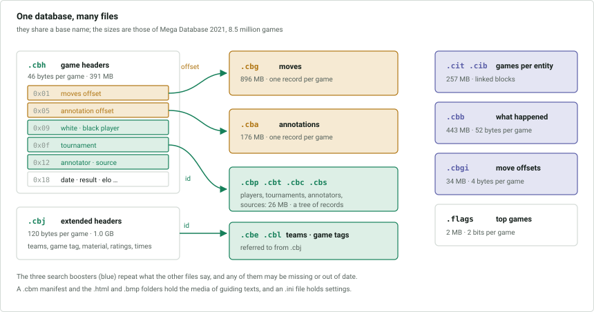

# The ChessBase 1 database format

A specification of the on-disk format used by ChessBase databases whose files
have the `.cbh` family of extensions, sufficient to implement a reader and a
writer. It was introduced in ChessBase 6 and is still what ChessBase writes for
databases with the `.cbh` extension. The format version byte in the `.cbh`
header is 1.

Anything not yet understood is marked **unknown**; [UNKNOWNS.md](UNKNOWNS.md)
gathers them. Where there is evidence for a likely meaning it is given as such.
Everything else is stated as fact.

| Document | Contents |
|---|---|
| [1-game-headers.md](1-game-headers.md) | `.cbh`, `.cbj`, `.flags`: one record per game or guiding text |
| [2-moves.md](2-moves.md) | `.cbg`: the moves of a game, and the body of a guiding text |
| [3-annotations.md](3-annotations.md) | `.cba`: comments, symbols and other annotations |
| [4-entities.md](4-entities.md) | `.cbp` `.cbt` `.cbtt` `.cbc` `.cbs` `.cbe` `.cbl`: players, tournaments, annotators, sources, teams, game tags |
| [5-search-boosters.md](5-search-boosters.md) | `.cit` `.cib` `.cit2` `.cib2` `.cbb` `.cbgi`: derived files that speed up searching |
| [6-multimedia.md](6-multimedia.md) | `.cbm` and the media folder |
| [7-behaviour.md](7-behaviour.md) | How ChessBase uses the format: deletion, reuse, holes, counters |
| [UNKNOWNS.md](UNKNOWNS.md) | Everything the specification leaves open, in one list |

## Files

A database is a set of files sharing one base name.

| Extension | Contents |
|---|---|
| `.cbh` | game headers, one fixed-size record per game or guiding text |
| `.cbj` | extended game headers: teams, material, ratings, timestamps |
| `.cbg` | moves, and the body of each guiding text |
| `.cba` | annotations |
| `.cbp` | players |
| `.cbt` | tournaments |
| `.cbtt` | additional tournament information |
| `.cbc` | annotators |
| `.cbs` | sources |
| `.cbe` | teams |
| `.cbl` | game tags |
| `.flags` | which games are Top Games |
| `.cbm` | manifest of the media files a guiding text uses |
| `.cit` `.cib` `.cit2` `.cib2` | for each entity, the games that refer to it |
| `.cbb` | for each game, events that happened in it |
| `.cbgi` | for each game, the offset of its moves |

The mandatory files are `.cbh`, `.cbg`, `.cba`, `.cbp`, `.cbt`, `.cbc` and
`.cbs`. The rest are optional: they were added by later versions of ChessBase, or
can be rebuilt from the others, or both. The search boosters in particular repeat
what the other files say, and any of them may be missing or out of date; see
[5-search-boosters.md](5-search-boosters.md).

Two folders named after the database belong to it: the `.html` folder holds the
media files that guiding texts use, and the `.bmp` folder holds embedded
pictures; see [6-multimedia.md](6-multimedia.md).

A database may also carry files that are not part of this format and are not
described here: `.ini` (settings), `.ico` (the icon), `.pgi`, the folders
`.patterns` and `.accelerators` that hold derived search data, and the opening
key files `.ckn` `.cko` `.ck1` `.ck2` `.ck3` `.cpn` `.cpo` `.cp1` `.cp2` `.cp3`.

Records in `.cbh` and `.cbj` are addressed by a 1-based **game id**. Entities
are addressed by a 0-based **entity id**, per entity type. Guiding texts share
the game id space with games.

## Conventions

Offsets are hexadecimal and relative to the start of the structure being
described. Sizes are in bytes.

`byte`, `short`, `int` and `long` are signed integers of 1, 2, 4 and 8 bytes.
`ushort` and `uint` are their unsigned counterparts, and `uint24` is an unsigned
integer of 3 bytes.

**Byte order differs between files.**

| File | Byte order |
|---|---|
| `.cbh` | big-endian |
| `.cbj` | the header little-endian, the records big-endian |
| `.cbg`, `.cba` | big-endian, except where stated |
| `.flags`, `.cbb` | big-endian |
| `.cbp` `.cbt` `.cbc` `.cbs` `.cbe` `.cbl` | little-endian |
| `.cbtt` | little-endian, except the tournament end date |
| `.cit` `.cib` `.cit2` `.cib2` `.cbgi` `.cbm` | little-endian |

A **string** in a fixed-size field is in ISO 8859-1, one byte per character, and
is zero-terminated when it is shorter than the field. The bytes after the
terminator have no meaning and often hold leftovers of earlier contents. A
character that the encoding cannot represent is stored as `?`. Where a string is
prefixed with its length, the layout is given at the point of use.

Fields whose meaning is unknown are zero unless stated otherwise. A writer
should reproduce the values it read, and write zero in a new record.

## File headers

Every file begins with a header, apart from a few small ones that are only a
list. The header of the `.cbh` file is the same size as its records.

| File | Header size | Contents |
|---|---|---|
| `.cbh` | 46 | record size, next game id, next media ids |
| `.cbj` | 32 | version, record size, record count |
| `.cbg` | 26, or 10 | file size, unused bytes |
| `.cba` | 26, or 10 | file size, unused bytes |
| `.cbp` `.cbt` `.cbc` `.cbs` `.cbe` `.cbl` | 28, or 32 | record count, root of the tree, record size, first deleted |
| `.cbtt` | 32 | version, record size, last index |
| `.flags` | 12 | bits per game, capacity |
| `.cit` `.cit2` | 12 | record size |
| `.cib` `.cib2` | 12 | block size, block count, first unused block |
| `.cbb` | 52 | record count, record size |
| `.cbgi` | 4 | game count |
| `.cbm` | 32 | record size, record count |

## Common encodings

### Dates

A date is packed into an integer:

| Bits | Field |
|---|---|
| 0-4 | day, 1-31 |
| 5-8 | month, 1-12 |
| 9-20 | year |

A part that is 0 is unknown, so 0 is an entirely unknown date and a year alone is
a valid date. The `.cbh` file stores a date in 3 bytes; everywhere else it is a
4-byte integer whose upper bits are zero.

### Timestamps

Two distinct encodings, both `long`, used in `.cbj`:

| Name | Epoch | Unit |
|---|---|---|
| creation | 2008-12-01 00:00 Europe/Berlin | 1/2¹⁰ second |
| last saved | 1582-10-15 00:00 UTC | 100 nanoseconds |

A last-saved timestamp of 0 means the game has not been saved since it was
created.

### Nation codes

A nation is a one-byte index into the same table [v2](../../v2/spec/README.md#nation-codes)
uses: IOC codes where one exists and ISO codes otherwise, index 0 meaning no
nation, and 196 meaning the internet. The same numbering identifies the language
of an annotation text; the languages of a guiding text use a smaller numbering,
see [2-moves.md](2-moves.md#guiding-texts).

### Squares

Squares are numbered `a1` = 0, `a2` = 1, … `a8` = 7, `b1` = 8, … `h8` = 63: file
by file, and within a file from rank 1 upward. A few annotations number them from
1 instead, which is stated where it happens.

### Symbols

The symbols ChessBase puts on a move or a position are the standard numeric
annotation glyphs (NAGs), one byte each: 1 is `!`, 2 is `?`, 3 is `!!`, 4 is
`??`, 5 is `!?`, 6 is `?!`, and so on.
