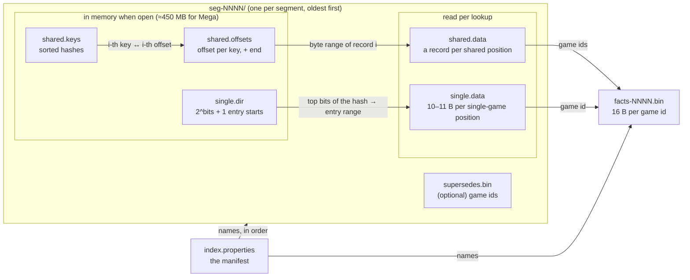
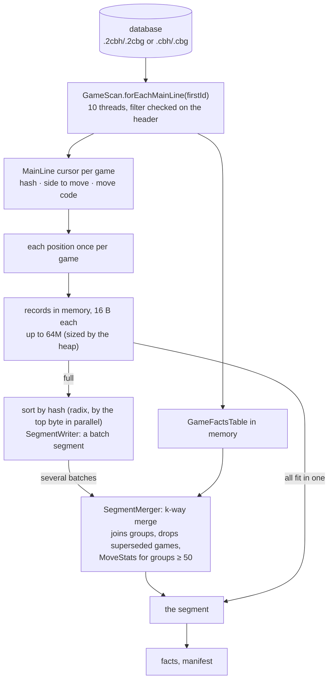
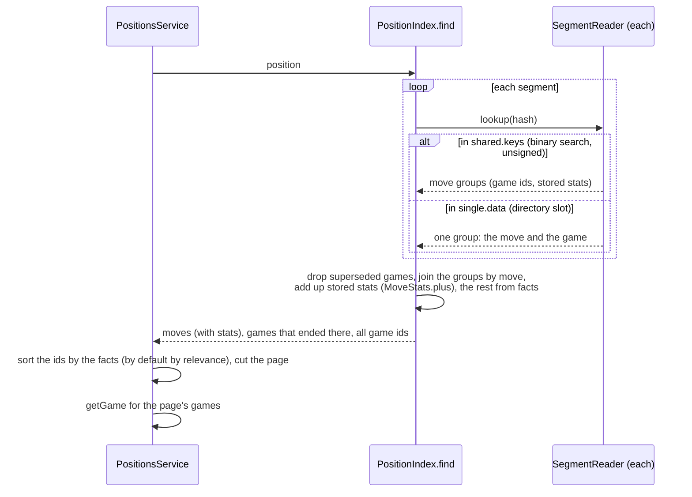
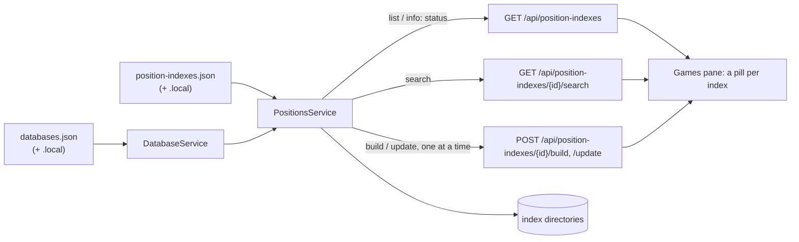
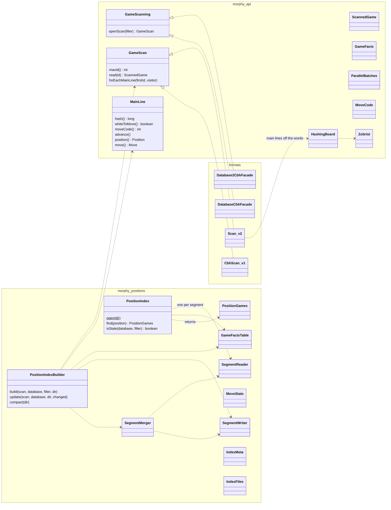

# Position indexes

How Morphy finds the games that reached a position, and what was played from it: the index
files, how they're built and read, the code behind them, and what could be simpler.

A **position index** maps every position of the games of a database (or of those matching a
filter) to the games that reached it and the move each played from it, with statistics of those
moves. The board's Games pane in the web app searches one; the service defines, builds and
serves them; the CLI can build and query them by hand.

- [Concepts](#concepts)
- [The index on disk](#the-index-on-disk)
- [Building, updating and compacting](#building-updating-and-compacting)
- [Looking up a position](#looking-up-a-position)
- [Index definitions and the service](#index-definitions-and-the-service)
- [The code](#the-code)
- [Numbers](#numbers)
- [What could be simpler](#what-could-be-simpler)

## Concepts

**A position is its 64-bit Zobrist hash** (`Position.getZobristHashLo()`). The en passant file
only counts when a pawn of the side to move can actually take, so `1.d4 Nf6 2.c4` and
`1.c4 Nf6 2.d4` are the same position. With some 690M distinct positions in a Megabase, the chance
that two of them share a hash is about 1%, and a full hash matching by chance in a lookup is far
rarer still; both are ignored.

**Only main lines are indexed.** Every position of a game's main line is an entry; a position the
game repeats counts once, with the move first played from it. Variations, guiding texts,
analyses, deleted games and Chess960 games are left out.

**Most positions are reached by one game.** In Mega Database 2026, 96.5% of the 688M distinct
positions are; the other 24M are reached by several games and hold 30% of the entries. The index
stores the two kinds differently:

- **Shared positions** (two games or more): the hash, and per move played from it the games that
  played it and, for moves of 50 games or more, their statistics.
- **Single-game positions**: a compact entry of the hash, the move and the game.

Both keep the full hash, so a lookup is exact and segments can be merged without reading any
game.

**An index is a list of segments, like Cassandra's sstables.** Each segment is an immutable,
complete sorted index of some games. A search looks the position up in every segment and joins
what they have. A build writes its games as one segment; an update adds a segment for the games
added since; a compaction merges the segments into one. A later segment can *supersede* games of
the earlier ones (changed or deleted games), whose entries there then don't count. Changed games
aren't detected yet: an update adds the games after the last one indexed, and changed games can
be given to it by id.

## The index on disk

An index is a directory, by default next to its database: `Mega.2cbh` has `Mega.positions` (the
CLI's default), and an index with id `classical` defined in the service is in
`Mega.classical.positions`. Numbers of fixed width are big-endian; *varint* is an unsigned number
in 7-bit groups, lowest first, the high bit set on all but the last.



| File | Size (Mega 2026) | Contents |
|---|---|---|
| `index.properties` | – | `IndexMeta`, the manifest: format version (2); when built and last updated; the database's main file size, modification time and game count (`DatabaseIdentity`); the filter; `recentSince` (newest year − 2, set by a build or compaction); the games indexed, those of the first segment, the highest game id indexed; the facts file; the segments, oldest first; the position counts |
| `facts-NNNN.bin` | 192 MB | `GameFactsTable`: two longs per game id, from 0 to the highest: result, date, both Elos, both player ids. What the move statistics and the sorting of a position's games need. Rewritten (under a new name) by every update |
| `seg-NNNN/segment.properties` | – | `SegmentMeta`: the position counts, the directory's bits, the bytes of a game id |
| `seg-NNNN/shared.keys` | 194 MB | The hashes of the shared positions, sorted as **unsigned** numbers |
| `seg-NNNN/shared.offsets` | 194 MB | A long per key: where its record starts in `shared.data`; one more for the end |
| `seg-NNNN/shared.data` | 882 MB | A record per shared position, below |
| `seg-NNNN/single.dir` | 67 MB | `int[2^bits + 1]`: for each value of the top bits of a hash, where its entries start in `single.data` (prefix sums). 24 bits for a large segment, fewer for a small one (about 32 entries per value) |
| `seg-NNNN/single.data` | 6.6 GB | An entry per single-game position, in hash order, below |
| `seg-NNNN/supersedes.bin` | – | The ids of the games whose entries in the earlier segments don't count; only in a segment that supersedes any |

**The manifest is the commit point.** A build, an update or a compaction writes its new files
first, then the manifest (to a temporary file, moved in place atomically); files it no longer
names are deleted after. A build is made in `<dir>.building` and moved in place at the end.

### A move

A move is 16 bits: whether White plays it (is to move in the position) in the top bit, and its
15-bit `MoveCode` below: `from | to << 6 | promotion << 12`, `0x7FFF` for a null move, and `0`
(a1 to a1, never a move) for the games that ended in the position (`IndexFiles.GAME_ENDED`).

### A shared position's record (`shared.data`)

```
varint  number of move groups << 1 | white to move
per group:
  u16     move (above)
  varint  number of games
  u8      1 if statistics follow, else 0          (only for 50 games or more, never for game ended)
  [stats] varints: games, white wins, draws, black wins, recent games, last year,
          Elo sum, Elo count, number of top players, then per player: id, Elo
  varint* the game ids, ascending, each as the difference from the one before
```

### A single-game position's entry (`single.data`)

```
u8*     the hash's bits below the directory's   (5 bytes with a 24-bit directory)
u16     move (above)
u24|u32 the game id                             (4 bytes for 16M game ids or more)
```

A lookup reads the slot's entries (some 40 for a Megabase) and finds the one with the hash.

### Game facts (`facts-NNNN.bin`)

```
long 1: result ordinal + 1 (0: no game) [bits 0-3] | date as year·512 + month·32 + day [4-24]
        | White's Elo [25-36] | Black's Elo [37-48]
long 2: White's player id + 1 [low 32 bits] | Black's player id + 1 [high 32 bits]   (0: none)
```

## Building, updating and compacting



1. **Reading the games.** `GameScan.forEachMainLine` hands each game's main line to a visitor on
   several threads, as a `MainLine` cursor. For a v2 database the cursor plays the move words
   straight onto a `HashingBoard`, which keeps the Zobrist hash up to date move by move, so no
   `Position`, `Move` or move tree is ever made. A v1 database goes through the full decoder. The
   scan reads the files in large pieces: 4,096 game headers at a time and their move records in a
   few spans (`RecordFile.readMany`). An update starts from the first game id after the index's
   last (`forEachMainLine(firstId, …)`), and reads the games it's given by id one by one.
2. **A record per position.** Each position of a game becomes 16 bytes, the hash and a payload of
   `game id << 17 | white to move << 16 | move code`, collected in memory; the game's facts go into
   the `GameFactsTable`.
3. **Batches.** When as many records are collected as a batch holds (`Runtime.maxMemory() / 48`,
   at most 64M), they're sorted by hash (spread by the top byte, then each part radix-sorted on its
   own thread) and written as a segment of their own, without statistics, by `SegmentWriter`. The
   records of a position become its move groups; one game makes a single-game entry.
4. **Merging.** `SegmentMerger` reads the batch segments through in hash order together (a k-way
   merge), joins the groups of a position found in several, and writes one segment with the
   statistics of the moves played in 50 games or more. When everything fit in one batch, it's
   written directly instead. The batches need about the room of the index itself; they're deleted
   as soon as merged.
5. **Finishing.** The facts and the manifest are written; a build's `.building` directory replaces
   any index there was.

**An update** writes the segment of the games added since (and of any changed games it's given,
listed in its `supersedes.bin`) in the same way, with the index's `recentSince`; a new facts file,
grown to the new highest id; and a manifest naming one segment more. It adds nothing when there are
no new games. It compacts the index when it has more than 4 segments, or the games of the segments
after the first are more than 10% of the index.

**A compaction** merges all segments into one with `SegmentMerger`, leaving out superseded
entries, and works out `recentSince` and every stored statistic again.

**A filter** is applied by the scan, before any moves are read: `GameScanning.openScan(filter)`
takes the game search's language. v2 compiles it once (`GameSearch.compile`) into a test of a game
header and the ids of the games of matching players, tournaments, ...; v1 runs its query planner
once and keeps the matching ids. The filter is recorded in the manifest; an update uses the
index's own.

## Looking up a position



Opening an index reads the manifest, the facts and each segment's in-memory files (about 0.3 s for
a Megabase in one segment). A lookup is, per segment, a binary search of the keys and one read of
a record, or one read of a directory slot: a few ms for most positions, 36 ms for 1.d4 Nf6 2.c4
(1.27M games), 0.25 s for the start position (12M game ids to unpack and sort). No game is read.

## Index definitions and the service

The service defines its indexes in `test-databases/position-indexes.json`, and the git-ignored
`position-indexes.local.json` next to it, in parallel to `databases.json`:

```json
{
  "classical": {
    "name": "Classical",
    "database": "reference",
    "filter": "tournament.time:normal",
    "path": "optional; default next to the database"
  }
}
```



An index's status is `ready`, `missing`, `stale` (its database changed since it was built or
updated, or its filter differs from the definition's), `building` (with the progress of a build or
an update) or `failed`. A
search still answers without an index: when it's missing, can't be read or was built with another
filter, every game of the definition's filter is played through for the position instead
(`PositionScanner`: some 4–5 s for Mega 2026 in v2, about a minute for a v1 Megabase, whose scan
decodes each game in full); the last few positions scanned are kept, up to 5M games all told, so
their later pages and other orders come at once. An index that is out of date is used anyway. The
response's `index` says which (`ready`, `stale` with the games added to the database since the
build, or `missing` with why), and the Games pane shows it in its top row. The games come most
relevant first by default: the players' average rating less 50 for every year before the index's
newest game (`PositionsService.RELEVANCE_ELO_PER_YEAR`), worked out from the facts. Builds and
updates run in the background on one thread, so they queue. An update (`POST .../update`) adds the
games added since, or builds the index when there is none or it's of another filter; the Games
pane offers it when an index is out of date with games missing, and a rebuild otherwise.

## The code



| Module | Class | Role |
|---|---|---|
| morphy-api | `GameScanning`, `GameScan` | The facade extension that reads every game fast, optionally filtered: `read(id)` one game decoded in full (`ScannedGame`: moves + `GameFacts`); `forEachMainLine` all main lines as `MainLine` cursors |
| | `MainLine` | A main line played through a move at a time: hash, side to move, move code, advance; `position()`/`move()` made when asked for |
| | `ParallelBatches` | Runs work over the game ids in batches on a thread per processor |
| | `HashingBoard`, `Zobrist`, `MoveCode` | (chess core) a mutable board whose hash equals `Position`'s, the shared Zobrist keys, and the 15-bit move code |
| morphy-cb2 | `Scan` | The v2 scan: headers in 4,096s, move records in spans, the filter compiled by `GameSearch.compile`, main lines off the move words (`MoveStreamCodec.mainLine`) |
| morphy-cbh | `CbhScan` | The v1 scan: game by game through the full decoder; the filter as ids from the query planner |
| morphy-positions | `PositionIndexBuilder` | Build, update and compact: games into batches of records, sorted, written as segments and merged; the manifest and the facts |
| | `SegmentWriter`, `SegmentReader`, `SegmentMeta` | A segment's files: the one writer of the format, and the reader (lookups, and every position in hash order for merging) |
| | `SegmentMerger` | The k-way merge of segments into one, superseded games left out |
| | `SupersededGames` | Which segment's entries of each game count |
| | `PositionIndex` | An open index: the manifest, the facts, a reader per segment, and `find`, which looks a position up in each, joins the groups, adds up their stats and resolves the moves |
| | `PositionScanner` | Without an index: plays through every main line of a scan for one position, giving what `find` would |
| | `PositionGames` | What `find` and `PositionScanner.find` return: the moves with their games and stats (ties by move code), the games that ended there, all the game ids, the games' facts and the recent year |
| | `PositionEntry`, `MoveGroup` (package-private) | A position as a segment holds it: its hash, side to move and move groups |
| | `MoveStats`, `RatedPlayer` | A move's statistics, worked out from facts or read from the index, and added up across segments |
| | `GameFactsTable` | The facts of every game, packed; or of only the games a scan found, looked up by id |
| | `IndexMeta`, `DatabaseIdentity`, `IndexFiles`, `Bytes` | The manifest and staleness, file names, I/O helpers and the move fields, varints |
| morphy-cli | `Positions` | `positions build`, `update`, `compact` and `lookup` |
| morphy-service | `PositionsService` | Definitions, statuses, the queue of builds and updates, searching and the response's summary |
| | `PositionsController` | The HTTP endpoints |
| | `PositionIndexConfig`, `PositionIndexInfo`, `PositionSearchResponse`, `PositionSummary`, `PositionMove`, `PositionPlayer`, `PositionIndexState` | A definition, a status, and the search's response, with how the index was used |

## Numbers

Mega Database 2026: 12M games, 953M main-line positions, 688M distinct, 24.2M shared.

| | |
|---|---|
| Full index | 8.2 GB (6.6 GB of it `single.data`), built in 222 s on a laptop with a 4 GB heap: 98 s reading the games into 15 batches (most of it waiting on the batches being sorted and written, 7 s each), 120 s merging them. Peak disk 16.4 GB: the batches and the index |
| Compaction | 78 s for the whole index in one segment (stats worked out again) |
| An update with no new games | 0.3 s (the facts written again) |
| Lookups | 0.3 s to open; 4 ms for a single-game position, 36 ms for 1.d4 Nf6 2.c4 (1.27M games), 0.25 s for the start position |

## What could be simpler

Done: the record formats are in one place (`SegmentWriter` writes them, `SegmentReader` reads
them), single-game positions need no game played through (they keep the full hash and the move),
and the bucket files are gone. What's left, ordered by how much it would help for how little:

1. **`PositionsService` does four things**: reading the definitions, statuses, the queue of builds
   and updates, and searching with its response. Splitting off the definitions (a
   `PositionIndexDefinitions` loaded once) and the queue would leave a service that only searches.
   Statuses also open every database to check its game count; they could rely on the main file's
   size and time alone.
2. **`PositionIndexBuilder` is 650 lines**: reading games, the batches and their sorting, and
   build, update and compact. Update and compact could be a class of their own (an
   `IndexMaintenance`), leaving the builder the games-to-segments part.
3. **The build waits while a batch is sorted and written** (7 s each, 15 times for Mega): handing a
   full batch to a writer thread while the next is collected would take some 50 s off a build, for
   one batch more in memory.
4. **`PositionIndexStats` in morphy-tools** has its own copy of the old bucket logic, from measuring
   before the index existed. It could go, or report on a built index instead.

What is **not** worth simplifying away: the split between shared and single-game positions (single
entries of 10 bytes rather than records of some 14), and `HashingBoard` (decoding went from 14 s to
4 s).
