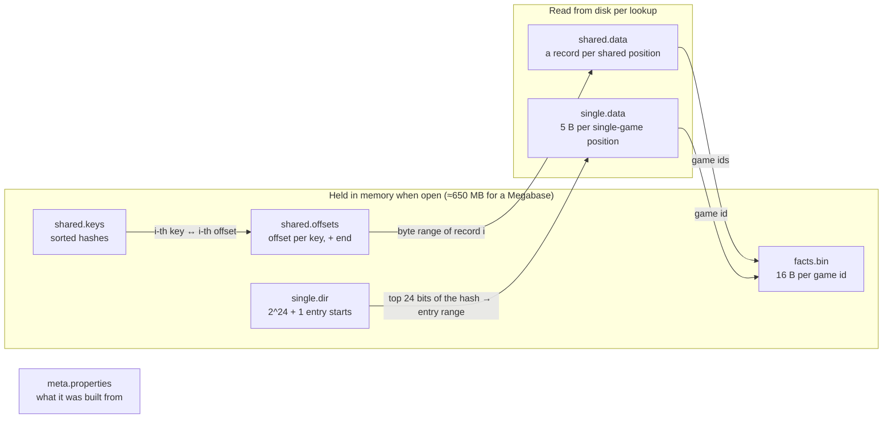
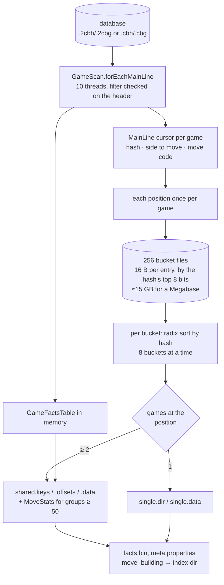
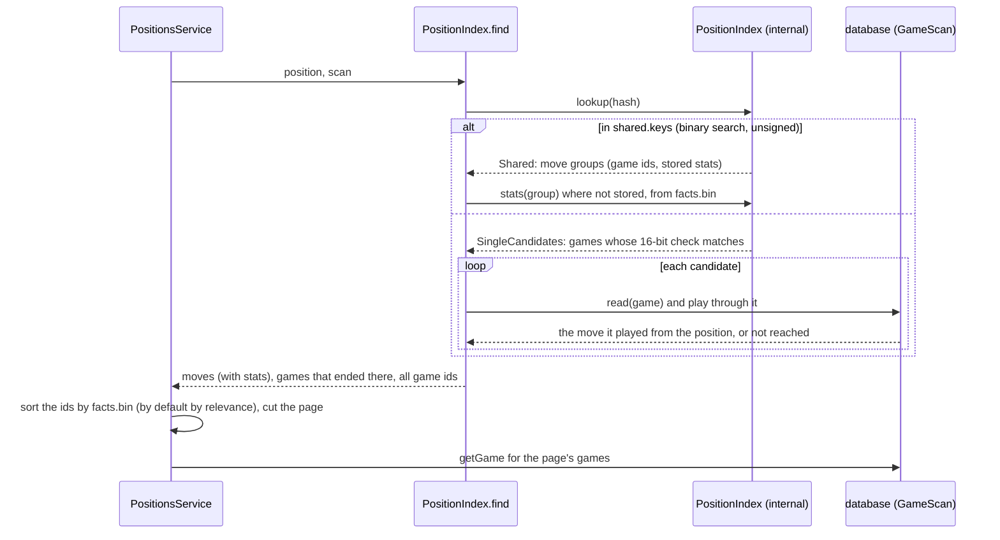
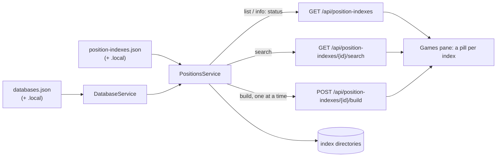
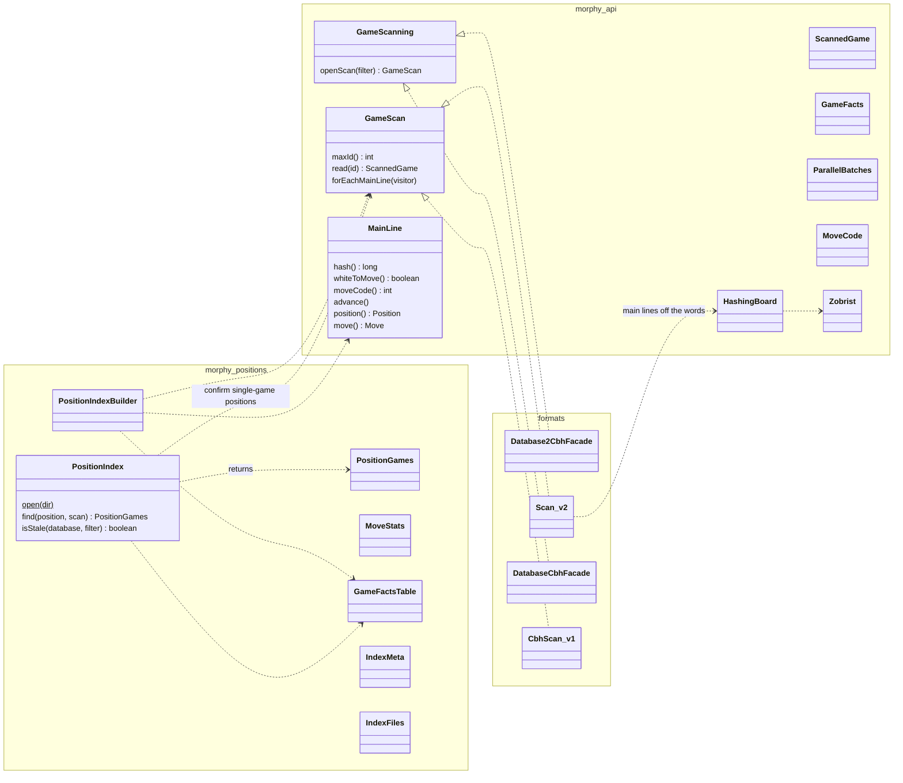

# Position indexes

How Morphy finds the games that reached a position, and what was played from it: the index
files, how they're built and read, the code behind them, and what could be simpler.

A **position index** maps every position of the games of a database (or of those matching a
filter) to the games that reached it and the move each played from it, with statistics of those
moves. The board's Games pane in the web app searches one; the service defines, builds and
serves them; the CLI can build and query them by hand.

- [Concepts](#concepts)
- [The index on disk](#the-index-on-disk)
- [Building an index](#building-an-index)
- [Looking up a position](#looking-up-a-position)
- [Index definitions and the service](#index-definitions-and-the-service)
- [The code](#the-code)
- [Numbers](#numbers)
- [What could be simpler](#what-could-be-simpler)

## Concepts

**A position is its 64-bit Zobrist hash** (`Position.getZobristHashLo()`). The en passant file
only counts when a pawn of the side to move can actually take, so `1.d4 Nf6 2.c4` and
`1.c4 Nf6 2.d4` are the same position. With some 690M distinct positions in a Megabase, the chance
that two of them share a hash is about 1%, and a full hash matching by chance in a lookup is far
rarer still; both are ignored. (Single-game positions keep only 40 bits of the hash, which do match
by chance about once in 1,600 lookups: those matches are caught by playing through the game.)

**Only main lines are indexed.** Every position of a game's main line is an entry; a position the
game repeats counts once, with the move first played from it. Variations, guiding texts,
analyses, deleted games and Chess960 games are left out.

**Most positions are reached by one game.** In Mega Database 2026, 96.5% of the 688M distinct
positions are; the other 24M are reached by several games and hold 30% of the entries. The index
stores the two kinds differently:

- **Shared positions** (two games or more): the full hash, and per move played from it the games
  that played it and, for moves of 50 games or more, their statistics.
- **Single-game positions**: only 40 bits of the hash and the game id. A match is confirmed by
  playing through that game, which also gives the move.

**An index is built as a whole and never updated.** It records what it was built from; when the
database changes, or the filter does, it is out of date and must be built again.

## The index on disk

An index is a directory, by default next to its database: `Mega.2cbh` has `Mega.positions` (the
CLI's default), and an index with id `classical` defined in the service is in
`Mega.classical.positions`. While it's built, the files are written to `<dir>.building`, which is
moved in place at the end. Numbers of fixed width are big-endian; *varint* is an unsigned number
in 7-bit groups, lowest first, the high bit set on all but the last.



| File | Size (Mega 2026) | Contents |
|---|---|---|
| `meta.properties` | – | `IndexMeta`: format version; when built; the database's main file size, modification time and game count (`DatabaseIdentity`); the filter; the games indexed; the position counts; `recentSince` (newest year − 2); the stats threshold (50); bytes per game id |
| `facts.bin` | 192 MB | `GameFactsTable`: two longs per game id, from 0 to the highest: result, date, both Elos, both player ids. What the move statistics and the sorting of a position's games need |
| `shared.keys` | 194 MB | The hashes of the shared positions, sorted as **unsigned** numbers |
| `shared.offsets` | 194 MB | A long per key: where its record starts in `shared.data`; one more for the end |
| `shared.data` | 882 MB | A record per shared position, below |
| `single.dir` | 67 MB | `int[2^24 + 1]`: for each value of the top 24 bits of a hash, where its entries start in `single.data` (prefix sums) |
| `single.data` | 3.3 GB | An entry per single-game position, in hash order, below |

### A shared position's record (`shared.data`)

```
varint  number of move groups
per group:
  u16     move code (from | to << 6 | promotion << 12; 0x7FFF null move; 0xFFFF the games that ended here)
  varint  number of games
  u8      1 if statistics follow, else 0          (only for 50 games or more, never for 0xFFFF)
  [stats] varints: games, white wins, draws, black wins, recent games, last year,
          Elo sum, Elo count, number of top players, then per player: id, Elo
  varint* the game ids, ascending, each as the difference from the one before
```

### A single-game position's entry (`single.data`)

```
u16     bits 39..24 of the hash      ┐ with the 24 bits that chose the directory slot,
u24|u32 the game id                  ┘ a 40-bit prefix of the hash
```

A lookup reads the slot's entries (some 40 on average for a Megabase) and keeps the games whose
16-bit check matches; each is then played through to confirm (see below).

### Game facts (`facts.bin`)

```
long 1: result ordinal + 1 (0: no game) [bits 0-3] | date as year·512 + month·32 + day [4-24]
        | White's Elo [25-36] | Black's Elo [37-48]
long 2: White's player id + 1 [low 32 bits] | Black's player id + 1 [high 32 bits]   (0: none)
```

## Building an index



1. **Reading the games** (`PositionIndexBuilder.decode`). `GameScan.forEachMainLine` hands each
   game's main line to a visitor on several threads, as a `MainLine` cursor. For a v2 database the
   cursor plays the move words straight onto a `HashingBoard`, which keeps the Zobrist hash up to
   date move by move, so no `Position`, `Move` or move tree is ever made (4 s for all of Mega
   2026's main lines). A v1 database goes through the full decoder. The scan reads the files in
   large pieces: 4,096 game headers at a time and their move records in a few spans
   (`RecordFile.readMany`).
2. **A record per position.** Each position of a game becomes 16 bytes, the hash and a payload of
   `game id << 17 | white to move << 16 | move code`, appended to one of 256 bucket files in the
   work directory by the hash's top 8 bits. The game's facts go into an in-memory
   `GameFactsTable`.
3. **Sorting and writing** (`PositionIndexBuilder.write`). Each bucket is read back, its file
   deleted, radix-sorted by the remaining 56 bits of the hash, and turned into records: a run of
   one record is a single-game entry, a longer run a shared position, its records sorted by move
   to make the groups. Buckets are prepared 8 at a time and written in order, so every file comes
   out in hash order.
4. **Finishing.** The directory's slot counts become prefix sums, `facts.bin` and
   `meta.properties` are written, and the `.building` directory replaces any index there was.

**A filter** is applied by the scan, before any moves are read: `GameScanning.openScan(filter)`
takes the game search's language. v2 compiles it once (`GameSearch.compile`) into a test of a game
header and the ids of the games of matching players, tournaments, ...; v1 runs its query planner
once and keeps the matching ids. The filter is recorded in `meta.properties`.

## Looking up a position



Opening an index reads the four in-memory files (about 0.4 s for a Megabase). A lookup is a
binary search of the keys and one read of a record (3–60 ms for most positions, 0.8 s for the
start position with 12M game ids to unpack and sort), or one read of a directory slot plus a game
to play through (a few ms).

## Index definitions and the service

The service defines its indexes in `test-databases/position-indexes.json`, and the git-ignored
`position-indexes.local.json` next to it, in parallel to `databases.json`:

```json
{
  "classical": {
    "name": "Classical",
    "database": "reference",
    "filter": "tournament.time:normal",
    "path": "optional; default next to the database"
  }
}
```



An index's status is `ready`, `missing`, `stale` (its database changed since it was built, or its
filter differs from the definition's), `building` (with the builder's progress) or `failed`. A
search of an index that isn't ready answers 409, saying how to build it. The games come most
relevant first by default: the players' average rating less 50 for every year before the index's
newest game (`PositionsService.RELEVANCE_ELO_PER_YEAR`), worked out from `facts.bin`. Builds run in the
background on one thread, so they queue; the bucket files go next to the index directory.

## The code



| Module | Class | Role |
|---|---|---|
| morphy-api | `GameScanning`, `GameScan` | The facade extension that reads every game fast, optionally filtered: `read(id)` one game decoded in full (`ScannedGame`: moves + `GameFacts`); `forEachMainLine` all main lines as `MainLine` cursors |
| | `MainLine` | A main line played through a move at a time: hash, side to move, move code, advance; `position()`/`move()` made when asked for |
| | `ParallelBatches` | Runs work over the game ids in batches on a thread per processor |
| | `HashingBoard`, `Zobrist`, `MoveCode` | (chess core) a mutable board whose hash equals `Position`'s, the shared Zobrist keys, and the 15-bit move code |
| morphy-cb2 | `Scan` | The v2 scan: headers in 4,096s, move records in spans, the filter compiled by `GameSearch.compile`, main lines off the move words (`MoveStreamCodec.mainLine`) |
| morphy-cbh | `CbhScan` | The v1 scan: game by game through the full decoder; the filter as ids from the query planner |
| morphy-positions | `PositionIndexBuilder` | Buckets, sorting, writing every file |
| | `PositionIndex` | An open index: the in-memory files, and `find`, which looks a position up, confirms single-game candidates by playing through the game, resolves the moves and fills in their stats |
| | `PositionGames` | What `find` returns: the moves with their games and stats, the games that ended there, all the game ids |
| | `Lookup`, `MoveGroup` (package-private) | A raw lookup: the move groups of a shared position, or the candidates of a single-game one |
| | `MoveStats`, `RatedPlayer` | A move's statistics, worked out from facts or read from the index |
| | `GameFactsTable` | The facts of every game, packed |
| | `IndexMeta`, `DatabaseIdentity`, `IndexFiles`, `Bytes` | Metadata and staleness, file names, I/O helpers and the `GAME_ENDED` code, varints |
| morphy-cli | `Positions` | `positions build` and `positions lookup` |
| morphy-service | `PositionsService` | Definitions, statuses, the build queue, searching and the response's summary |
| | `PositionsController` | The HTTP endpoints |
| | `PositionIndexConfig`, `PositionIndexInfo`, `PositionSearchResponse`, `PositionSummary`, `PositionMove`, `PositionPlayer`, `PositionIndexUnavailableException` | A definition, a status, and the search's response |

## Numbers

Mega Database 2026: 12M games, 953M main-line positions, 688M distinct, 24.2M shared.

| | |
|---|---|
| Full index | 4.85 GB, built in about 60–90 s on a laptop (decoding 4 s; the rest writing, reading back and sorting ≈15 GB of bucket files, which depends a lot on the disk) |
| Classical games only (`tournament.time:normal`, 10.2M games) | 3.8 GB, 41 s |
| Lookups | 0.4 s to open; a few ms for most positions, 0.06 s for 1.d4 Nf6 2.c4 (1.27M games), 0.8 s for the start position |

## What could be simpler

The feature grew in steps, through several experiments, and it shows. Ordered by how much they'd
help for how little:

Done so far: `GameScan.forEach` (it had no caller) and `PositionKeys` (mostly forwarding) are
gone; `PositionIndex.find` replaced `PositionGames.find`, so `Lookup` and `MoveGroup` are
internal; `isStale` is one method, taking the filter. What's left, ordered by how much it would
help for how little:

1. **The record formats are split between the writer and the reader.** A shared position's record
   is written in `PositionIndexBuilder.writePosition` (and `MoveStats.write`) and read in
   `PositionIndex.readShared` (and `MoveStats.read`); a single-game entry is written in
   `PositionIndexBuilder.prepare` and read in `PositionIndex.readSingle`; the payload is packed in
   the builder. One class owning each format both ways (say `IndexRecords`, next to `IndexFiles`)
   would put the whole on-disk format in one place, and make the builder shorter.
2. **`PositionsService` does four things** in 500 lines: reading the definitions, statuses, the
   build queue, and searching with its response. Splitting off the definitions (a
   `PositionIndexDefinitions` loaded once) and the build queue would leave a service that only
   searches. Statuses also open every database to check its game count; they could rely on the
   main file's size and time alone.
3. **Confirming a single-game position decodes the whole game** (`GameScan.read` → `ScannedGame`
   → `moveAfter` over a `GameMovesModel`). A `MainLine` for one game would do it without the
   tree, and `ScannedGame` would then only serve tools and tests.
4. **`PositionIndexBuilder` is 520 lines** of four parts: reading games into buckets, the bucket
   files, sorting, and writing. With the formats moved out (point 1) it's about 400; the bucket
   files could be a class of their own.
5. **`PositionIndexStats` in morphy-tools** has its own copy of the bucket logic, from measuring
   before the index existed. It could go, or report on a built index instead.

What is **not** worth simplifying away: the split between shared and single-game positions (it's
what keeps the index at 4.85 GB rather than 11 GB), `HashingBoard` (decoding went from 14 s to
4 s), and the bucket files (an in-memory build was tried: no faster, and much more memory).
